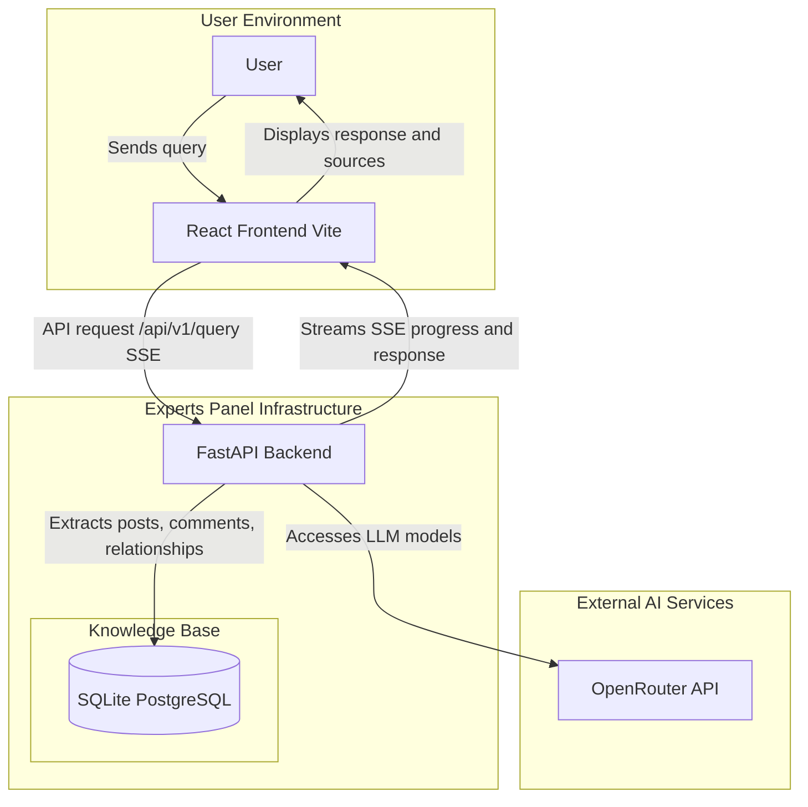
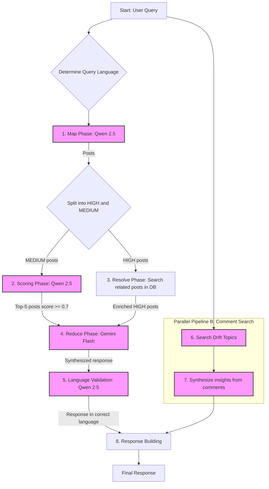
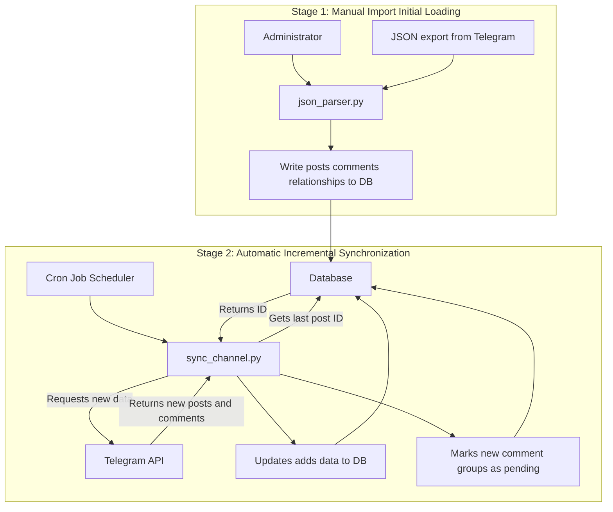
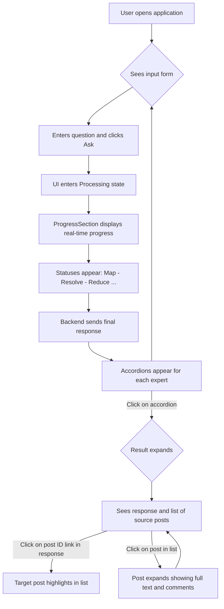
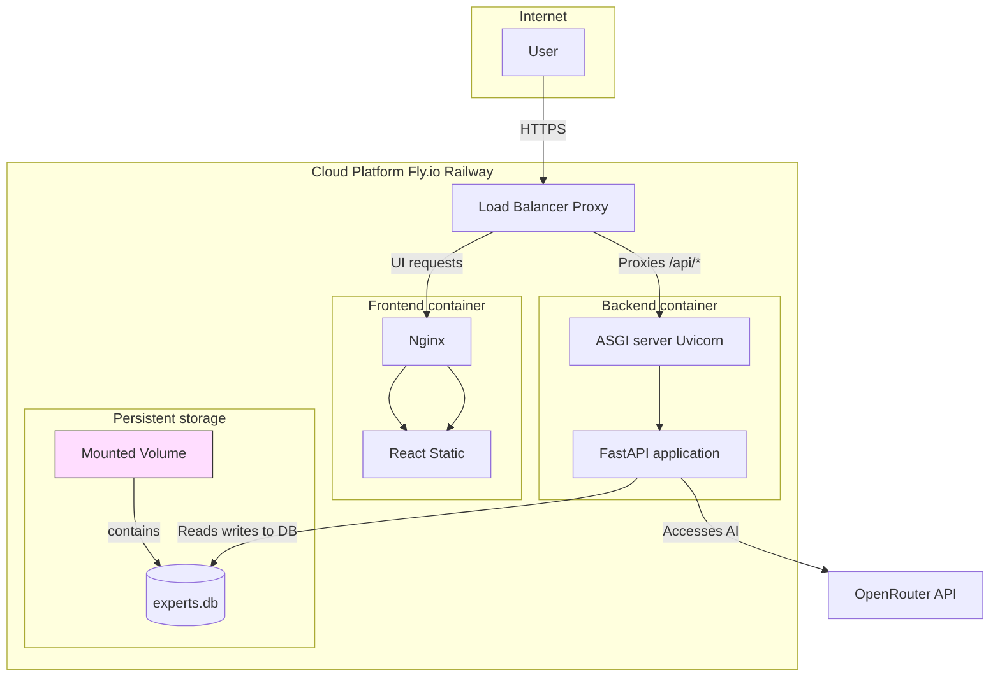

# Experts Panel

[](https://github.com/andreysazonov/Experts_panel/actions)
[](LICENSE)
[](https://python.org)
[](https://fastapi.tiangolo.com)
[](https://reactjs.org)

**Intelligent system for analyzing expert Telegram channels using multi-model AI architecture**

Experts Panel is a powerful tool for semantic search and analysis of content from expert Telegram channels. The system uses an advanced **8-phase Map-Resolve-Reduce pipeline architecture** with multiple AI models to provide accurate and contextually relevant answers.

## 🏗️ System Architecture

### High-Level Architecture



### Intelligent Query Processing Pipeline



### Data Lifecycle



### User Journey



### Deployment Architecture



## ✨ Key Features

- **🧠 8-phase Map-Resolve-Reduce Architecture**: Advanced pipeline with differential HIGH/MEDIUM posts processing
- **🎯 Multi-model AI Strategy**: Qwen 2.5-72B/32B (Map+Scoring+Translation+Validation, configurable via MODEL_ANALYSIS), Gemini 2.0 Flash (Reduce+Synthesis), GPT-4o-mini (Matching)
- **🔍 Smart Semantic Search**: Finds relevant posts by meaning, not keywords
- **📊 Medium Posts Hybrid Reranking**: Hybrid system with threshold ≥0.7 and top-5 selection
- **💬 Comment Drift Analysis**: Separate pipeline for comment and discussion analysis
- **🌐 Language Validation Phase**: Response language validation and RU→EN translation when needed
- **⚡ Real-time**: Processing progress display via Server-Sent Events
- **👥 Multi-expert Support**: `expert_id` support for data isolation and parallel processing
- **🔄 Automatic Synchronization**: Incremental data updates from Telegram channels

## 🚀 Quick Start

### Prerequisites

- Python 3.11+
- Node.js 18+
- OpenRouter API key

### Installation and Setup

```bash
# 1. Clone repository
git clone https://github.com/andreysazonov/Experts_panel.git
cd Experts_panel

# 2. Setup environment variables
cp .env.example .env
# Edit .env adding your OPENROUTER_API_KEY

# 3. Start backend
cd backend
pip install -r requirements.txt
python3 -m uvicorn src.api.main:app --reload --port 8000

# 4. Start frontend (in new terminal)
cd frontend
npm install
npm run dev
```

Application will be available at http://localhost:3001

## 🛠️ Data Management

### Telegram Data Import

```bash
# Import JSON file with expert_id specified
cd backend && python -m src.data.json_parser data/exports/channel.json --expert-id refat

# Interactive comment addition
cd backend && python -m src.data.comment_collector

# Telegram channel synchronization
cd backend && python sync_channel.py --dry-run --expert-id refat
cd backend && python sync_channel.py --expert-id refat
```

### Drift Analysis and Database

```bash
# Drift analysis in comments (required after data reimport)
cd backend && python analyze_drift.py

# Database management
cd backend && python -m src.models.database  # Interactive management (init/reset/drop)

# SQLite database creation and migration
sqlite3 data/experts.db < schema.sql
sqlite3 data/experts.db < backend/migrations/001_create_comment_group_drift.sql
sqlite3 data/experts.db < backend/migrations/002_add_sync_state.sql
sqlite3 data/experts.db < backend/migrations/003_add_expert_id.sql
```

## 📚 API Usage

### Basic Query

```bash
curl -X POST http://localhost:8000/api/v1/query \
  -H "Content-Type: application/json" \
  -d '{"query": "Your question", "stream_progress": false}'
```

### Query Specific Expert

```bash
curl -X POST http://localhost:8000/api/v1/query \
  -H "Content-Type: application/json" \
  -d '{"query": "Your question", "expert_filter": ["refat"], "stream_progress": false}'
```

### Environment Variables

```bash
# Main variables
OPENROUTER_API_KEY=your-key-here
DATABASE_URL=sqlite:///data/experts.db

# Model Configuration
# Analysis models for Map, Medium Scoring, Translation, and Language Validation phases
# Cost optimization: qwen-2.5-32b for ~60-70% cost reduction
# Maximum quality: qwen-2.5-72b for highest accuracy (default)
MODEL_ANALYSIS=qwen/qwen-2.5-72b-instruct

# Medium Posts Reranking
MEDIUM_SCORE_THRESHOLD=0.7
MEDIUM_MAX_SELECTED_POSTS=5
MEDIUM_MAX_POSTS=50

# Performance
MAX_POSTS_LIMIT=500
CHUNK_SIZE=20
REQUEST_TIMEOUT=300
```

## 🏗️ Technical Architecture

### Technology Stack

- **Backend**: FastAPI, SQLAlchemy 2.0, Pydantic v2
- **Frontend**: React 18, TypeScript, Vite
- **Database**: SQLite / PostgreSQL with full `expert_id` isolation
- **AI Models**: OpenRouter API (Qwen 2.5-72B/32B configurable, Gemini 2.0 Flash, GPT-4o-mini)
- **Deployment**: Docker, Fly.io

### Project Structure

```
backend/
├── src/
│   ├── models/       # SQLAlchemy models with expert_id fields
│   ├── services/     # Map-Resolve-Reduce pipeline
│   │   ├── medium_scoring_service.py    # Medium Posts Reranking
│   │   ├── language_validation_service.py # Language Validation
│   │   └── drift_analysis_service.py    # Comment Drift Analysis
│   ├── api/          # FastAPI endpoints
│   ├── data/         # Telegram data import and parsing
│   └── utils/        # Utilities and converters
├── prompts/          # LLM prompts (optimized per model)
├── migrations/       # Database migrations with expert_id support
└── tests/            # Validation tests

frontend/
├── src/
│   ├── components/   # React components with expertId support
│   ├── services/     # API client with SSE streaming
│   └── types/        # TypeScript interfaces
└── public/           # Static assets

data/
├── exports/          # Telegram JSON files by expert_id
└── experts.db        # SQLite database with multi-expert support
```

### Multi-Expert Architecture

- **Full Data Isolation**: Every post, comment, and analysis result has `expert_id`
- **Parallel Processing**: All experts processed simultaneously to reduce response time
- **Scalability**: Easy addition of new Telegram channels via `expert_id`
- **SSE Tracking**: Real-time display of active experts via progress events

## 🚀 Production Deployment

### Fly.io Deployment

```bash
# 1. Install Fly CLI
curl -L https://fly.io/install.sh | sh
fly auth login

# 2. Deploy application
fly deploy

# 3. Setup secrets
fly secrets set OPENROUTER_API_KEY=your-key-here

# 4. Health check
curl https://experts-panel.fly.dev/health
```

## 📚 Documentation

- [Pipeline Architecture](docs/pipeline-architecture.md)
- [Multi-Expert Setup](docs/multi-expert-guide.md)
- [API Documentation](http://localhost:8000/docs)
- [Development Guide](docs/development-guide.md)

## 🤝 Contributing

1. Fork the repository
2. Create your feature branch (`git checkout -b feature/AmazingFeature`)
3. Commit your changes (`git commit -m 'Add some AmazingFeature'`)
4. Push to the branch (`git push origin feature/AmazingFeature`)
5. Open a Pull Request

## 📄 License

This project is licensed under the MIT License - see the [LICENSE](LICENSE) file for details.

## 🙏 Acknowledgments

- [OpenRouter](https://openrouter.ai/) for access to cutting-edge AI models
- [FastAPI](https://fastapi.tiangolo.com/) for the powerful framework
- [React](https://reactjs.org/) for the excellent UI framework

---

**Experts Panel** — turning Telegram channel chaos into structured knowledge 💡