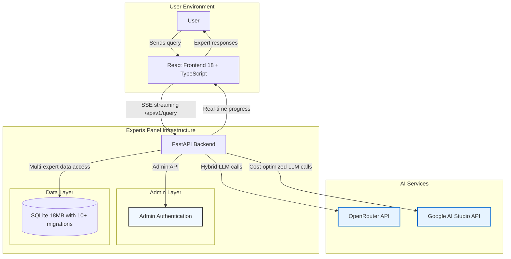
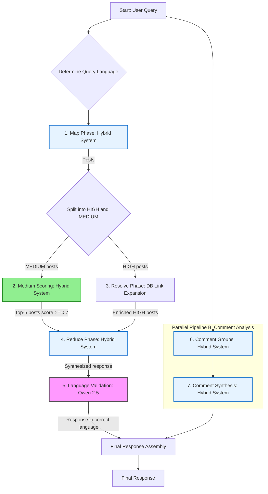
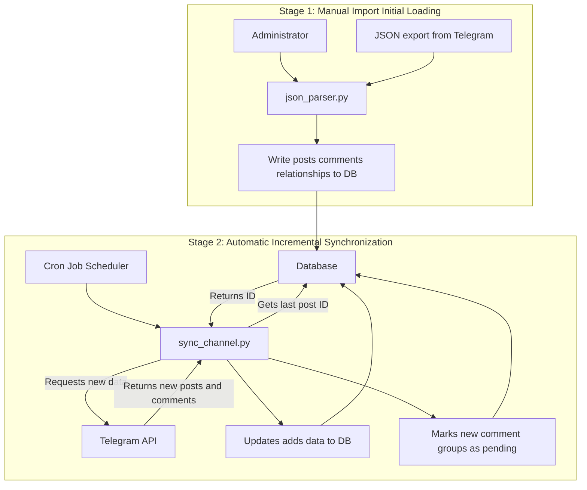
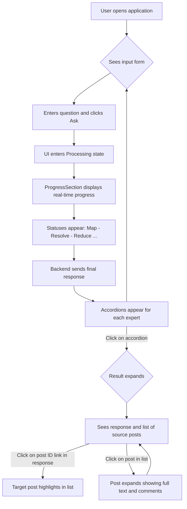
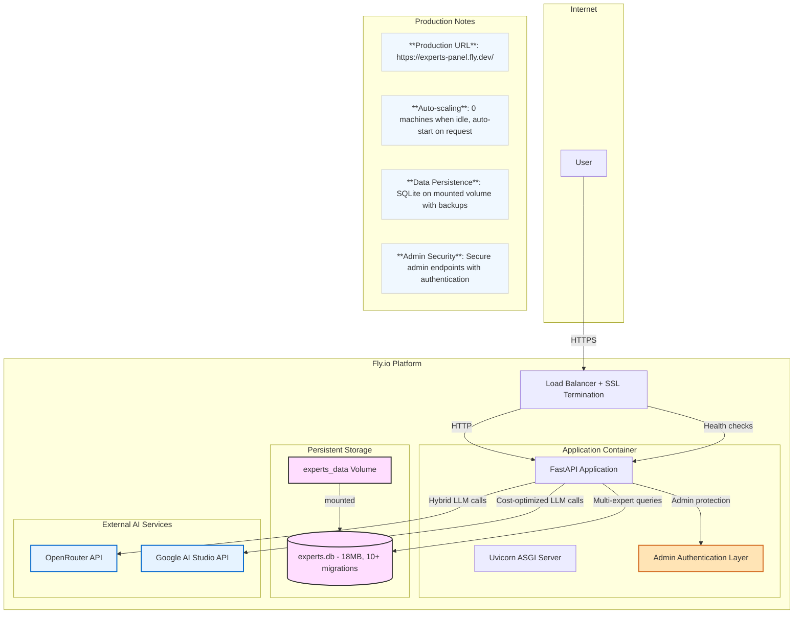

# Experts Panel

[](https://github.com/andreysazonov/Experts_panel/actions)
[](LICENSE)
[](https://python.org)
[](https://fastapi.tiangolo.com)
[](https://reactjs.org)

**Intelligent system for analyzing expert Telegram channels using multi-model AI architecture**

Experts Panel is a powerful tool for semantic search and analysis of content from expert Telegram channels. The system uses an advanced **7-phase Map-Resolve-Reduce pipeline architecture** with hybrid multi-model AI strategy to provide accurate and contextually relevant answers.

## 🏗️ System Architecture

### High-Level Architecture



### Intelligent Query Processing Pipeline



**Hybrid Model Strategy (Cost-Optimized)**:
- **Map Phase**: Qwen 2.5-72B → Gemini 2.0 Flash Lite (OpenRouter primary, Google fallback)
- **Medium Scoring**: Gemini 2.0 Flash → Qwen 2.5-72B (99% free tier usage)
- **Reduce Phase**: Gemini 2.0 Flash → Qwen 2.5-72B (Google primary, OpenRouter fallback)
- **Analysis Tasks**: Qwen 2.5-72B (Translation, Validation)
- **Comment Groups**: Gemini 2.0 Flash → Qwen 2.5-72B (cost optimization)
- **Translation Service**: Google Gemini 2.0 Flash (primary, free tier)

### Data Lifecycle



### User Journey



### Deployment Architecture



## ✨ Key Features

- **🧠 7-phase Map-Resolve-Reduce Architecture**: Advanced pipeline with differential HIGH/MEDIUM posts processing
- **🎯 Cost-Optimized Hybrid Strategy**: Smart primary → fallback system with 99% free tier usage via Google AI Studio, OpenRouter fallback
- **🔍 Smart Semantic Search**: Finds relevant posts by meaning, not keywords
- **📊 Medium Posts Reranking**: Hybrid scoring system with threshold ≥0.7 and top-5 selection
- **💬 Comment Groups & Synthesis**: Hybrid pipeline for comment drift analysis and insights extraction
- **🌐 Language Validation**: Response language validation and translation when needed
- **⚡ Real-time**: Processing progress display via Server-Sent Events with error handling
- **👥 Multi-expert Support**: Complete data isolation with `expert_id` and parallel processing
- **🔄 Dynamic Expert Loading**: Experts loaded from database with metadata centralization
- **🔒 Production Ready**: Admin authentication, security hardening with API key masking and robust error handling

## 🚀 Quick Start

### Prerequisites

- Python 3.11+
- Node.js 18+
- OpenRouter API key

### Installation and Setup

```bash
# 1. Clone repository
git clone https://github.com/andreysazonov/Experts_panel.git
cd Experts_panel

# 2. Setup environment variables
cp .env.example .env
# Edit .env adding your OPENROUTER_API_KEY

# 3. Start backend
cd backend
pip install -r requirements.txt
python3 -m uvicorn src.api.main:app --reload --port 8000

# 4. Start frontend (in new terminal)
cd frontend
npm install
npm run dev
```

Application will be available at http://localhost:3000

## 🛠️ Data Management

### Telegram Data Import

```bash
# Import JSON file with expert_id specified
cd backend && python -m src.data.json_parser data/exports/channel.json --expert-id refat

# Interactive comment addition
cd backend && python -m src.data.comment_collector

# Telegram channel synchronization
cd backend && python sync_channel.py --dry-run --expert-id refat
cd backend && python sync_channel.py --expert-id refat
```

### Drift Analysis and Database

```bash
# Drift analysis in comments (required after data reimport)
cd backend && python analyze_drift.py

# Database management
cd backend && python -m src.models.database  # Interactive management (init/reset/drop)

# SQLite database creation and migration
sqlite3 data/experts.db < schema.sql
sqlite3 data/experts.db < backend/migrations/001_create_comment_group_drift.sql
sqlite3 data/experts.db < backend/migrations/002_add_sync_state.sql
sqlite3 data/experts.db < backend/migrations/003_add_expert_id.sql
```

## 📚 API Usage

### Basic Query

```bash
curl -X POST http://localhost:8000/api/v1/query \
  -H "Content-Type: application/json" \
  -d '{"query": "Your question", "stream_progress": false}'
```

### Query Specific Expert

```bash
curl -X POST http://localhost:8000/api/v1/query \
  -H "Content-Type: application/json" \
  -d '{"query": "Your question", "expert_filter": ["refat"], "stream_progress": false}'
```

### Additional Endpoints

```bash
# Get specific post with translation
curl "http://localhost:8000/api/v1/posts/12345?expert_id=refat&query=What is AI?&translate=true"

# Batch retrieve multiple posts
curl -X POST http://localhost:8000/api/v1/posts/by-ids \
  -H "Content-Type: application/json" \
  -d '{"post_ids": [123, 456, 789], "expert_id": "refat"}'

# Health check
curl http://localhost:8000/health

# API information
curl http://localhost:8000/api/info

# Debug logging (for development)
curl -X POST http://localhost:8000/api/v1/log-batch \
  -H "Content-Type: application/json" \
  -d '[{"timestamp": "2025-01-02T10:00:00Z", "type": "console", "source": "test", "message": "Test log"}]'
```

### Environment Variables

```bash
# Main variables
OPENROUTER_API_KEY=your-openrouter-key-here
DATABASE_URL=sqlite:///data/experts.db

# Google AI Studio (optional, automatic fallback to OpenRouter)
GOOGLE_AI_STUDIO_API_KEY=your-google-ai-studio-key-1,key-2,key-3

# Cost-Optimized Hybrid Model Configuration
# Map Phase: OpenRouter primary, Google AI Studio fallback
MODEL_MAP_PRIMARY=qwen/qwen-2.5-72b-instruct
MODEL_MAP_FALLBACK=gemini-2.0-flash-lite

# Medium Scoring: Cost optimization (99% free tier usage)
MODEL_MEDIUM_SCORING_PRIMARY=gemini-2.0-flash
MODEL_MEDIUM_SCORING_FALLBACK=qwen/qwen-2.5-72b-instruct

# Synthesis Phase: Google AI Studio primary, OpenRouter fallback
MODEL_SYNTHESIS_PRIMARY=gemini-2.0-flash
MODEL_SYNTHESIS_FALLBACK=qwen/qwen-2.5-72b-instruct

# Comment Groups: Cost optimization
MODEL_COMMENT_GROUPS_PRIMARY=gemini-2.0-flash
MODEL_COMMENT_GROUPS_FALLBACK=qwen/qwen-2.5-72b-instruct

# Analysis & Translation Tasks
MODEL_ANALYSIS=qwen/qwen-2.5-72b-instruct
MODEL_TRANSLATION_PRIMARY=gemini-2.0-flash

# Production Settings
ENVIRONMENT=production  # Set to "development" for detailed config logging
API_HOST=0.0.0.0
API_PORT=8000

# Admin Authentication
ADMIN_SECRET_KEY=your-admin-secret-key-here

# Medium Posts Reranking
MEDIUM_SCORE_THRESHOLD=0.7
MEDIUM_MAX_SELECTED_POSTS=5
MEDIUM_MAX_POSTS=50

# Performance
MAX_POSTS_LIMIT=500
CHUNK_SIZE=20
REQUEST_TIMEOUT=300
```

**Model Strategy Notes:**
- **Cost Optimization**: 99% free tier usage with Google AI Studio as primary for most phases
- **Key Rotation**: Multiple Google AI Studio keys supported with automatic rotation
- **Smart Fallback**: Automatic OpenRouter fallback when Google AI Studio quota exhausted
- **Development Mode**: Set `ENVIRONMENT=development` to see masked API keys in logs

## 🏗️ Technical Architecture

### Technology Stack

- **Backend**: FastAPI, SQLAlchemy 2.0, Pydantic v2, uvicorn, hybrid LLM adapter
- **Frontend**: React 18, TypeScript, Vite, React Query, React Hot Toast, Tailwind CSS
- **Database**: SQLite (18MB) with 10+ migrations, full `expert_id` isolation and persistent volumes
- **AI Models**: Cost-optimized hybrid system with Google AI Studio (Gemini 2.0 Flash/Flash Lite) + OpenRouter API (Qwen 2.5-72B)
- **Deployment**: Docker, Fly.io with admin authentication, health checks and volume mounting

### Project Structure

```
backend/
├── src/
│   ├── models/       # SQLAlchemy models with expert_id fields
│   ├── services/     # 7-phase Map-Resolve-Reduce pipeline
│   │   ├── map_service.py                 # Map Phase (Hybrid LLM)
│   │   ├── medium_scoring_service.py      # Medium Posts Reranking (Hybrid)
│   │   ├── simple_resolve_service.py      # Resolve Phase (depth 1)
│   │   ├── reduce_service.py              # Reduce Phase (Hybrid LLM)
│   │   ├── language_validation_service.py # Language Validation
│   │   ├── comment_group_map_service.py   # Comment Groups (Hybrid)
│   │   ├── comment_synthesis_service.py   # Comment Synthesis (Hybrid)
│   │   ├── translation_service.py         # Hybrid Translation Service
│   │   ├── hybrid_llm_adapter.py          # Core Hybrid LLM Adapter
│   │   └── google_ai_studio_client.py     # Google AI Studio Client
│   ├── api/          # FastAPI endpoints
│   │   ├── admin_endpoints.py             # Admin Authentication
│   │   └── simplified_query_endpoint.py   # Main Query Processing
│   ├── data/         # Telegram data import and parsing
│   ├── utils/        # Utilities and enhanced error handling
│   └── config.py     # Hybrid model configuration
├── prompts/          # LLM prompts (optimized per model)
├── migrations/       # Database migrations (10+ migration files)
└── tests/            # Validation tests

frontend/
├── src/
│   ├── components/   # React components with real-time SSE progress
│   │   ├── ExpertAccordion.tsx            # Primary Expert UI Component
│   │   ├── ProgressSection.tsx           # Enhanced pipeline progress
│   │   ├── ExpertResponse.tsx             # Expert response rendering
│   │   └── DebugLogger.tsx                # Enhanced debug logging
│   ├── services/     # API client with SSE streaming
│   ├── types/        # TypeScript interfaces
│   └── hooks/        # Custom React hooks
├── public/           # Static assets
└── package.json      # Dependencies: React Query, Hot Toast, etc.

data/
├── exports/          # Telegram JSON files by expert_id
├── experts.db        # SQLite database (18MB, 10+ migrations)
└── backend.log       # Backend API and pipeline logs
```

### Multi-Expert Architecture

- **Full Data Isolation**: Every post, comment, and analysis result has `expert_id` with complete separation
- **Parallel Processing**: All experts processed simultaneously to reduce response time
- **Scalability**: Easy addition of new Telegram channels via `expert_id`
- **SSE Tracking**: Real-time display of active experts via progress events
- **Resource Optimization**: Independent processing per expert with configurable filtering
- **Dynamic Discovery**: Automatic expert detection from database without hardcoding

## 🚀 Production Deployment

### Fly.io Deployment (15 minutes)

```bash
# 1. Install Fly CLI
curl -L https://fly.io/install.sh | sh
fly auth login

# 2. Deploy application
fly deploy

# 3. Setup required secrets
fly secrets set OPENROUTER_API_KEY=your-openrouter-key-here
fly secrets set GOOGLE_AI_STUDIO_API_KEY=your-google-ai-studio-key-here
fly secrets set ADMIN_SECRET_KEY=your-admin-secret-key-here

# 4. Configure production environment
fly secrets set ENVIRONMENT=production
fly secrets set MODEL_MAP_PRIMARY=qwen/qwen-2.5-72b-instruct
fly secrets set MODEL_SYNTHESIS_PRIMARY=gemini-2.0-flash

# 5. Health check
curl https://experts-panel.fly.dev/health

# 6. Monitor deployment
fly logs -a experts-panel
```

**Production Features:**
- ✅ **Auto-deployment**: Automatic deployment on push to main branch
- ✅ **Admin Authentication**: Secure admin endpoints with authentication
- ✅ **Health monitoring**: Built-in health checks with automatic restarts
- ✅ **Persistent data**: SQLite database (18MB) mounted on persistent volume
- ✅ **Security**: Non-root container, SSL termination, API key masking
- ✅ **Scalability**: Automatic scaling with 0 machines when idle
- ✅ **Cost Optimization**: 99% free tier usage with hybrid model strategy
- ✅ **Monitoring**: Real-time logs and deployment tracking

**Live Application**: https://experts-panel.fly.dev/

## 📚 Documentation

- [Pipeline Architecture](CLAUDE.md) - Complete 7-phase pipeline documentation
- [Backend Architecture](backend/CLAUDE.md) - FastAPI services and API reference
- [Frontend Development](frontend/CLAUDE.md) - React components and SSE integration
- [API Documentation](https://experts-panel.fly.dev/docs) - Interactive OpenAPI docs
- [Production Deployment](backend/CLAUDE.md#production-deployment) - Complete deployment guide
- [Prompts Library](backend/prompts/) - LLM prompts optimized per model

**Quick Links:**
- 🔧 **Development Setup**: [Quick Start Guide](#-quick-start)
- 🚀 **Production Deploy**: [Fly.io Guide](#-production-deployment-15-minutes)
- 📊 **Live Demo**: https://experts-panel.fly.dev/
- 🔍 **API Explorer**: https://experts-panel.fly.dev/docs

## 🤝 Contributing

1. Fork the repository
2. Create your feature branch (`git checkout -b feature/AmazingFeature`)
3. Commit your changes (`git commit -m 'Add some AmazingFeature'`)
4. Push to the branch (`git push origin feature/AmazingFeature`)
5. Open a Pull Request

## 📄 License

This project is licensed under the MIT License - see the [LICENSE](LICENSE) file for details.

## 🙏 Acknowledgments

- [OpenRouter](https://openrouter.ai/) for access to cutting-edge AI models
- [FastAPI](https://fastapi.tiangolo.com/) for the powerful framework
- [React](https://reactjs.org/) for the excellent UI framework

---

**Experts Panel** — turning Telegram channel chaos into structured knowledge 💡