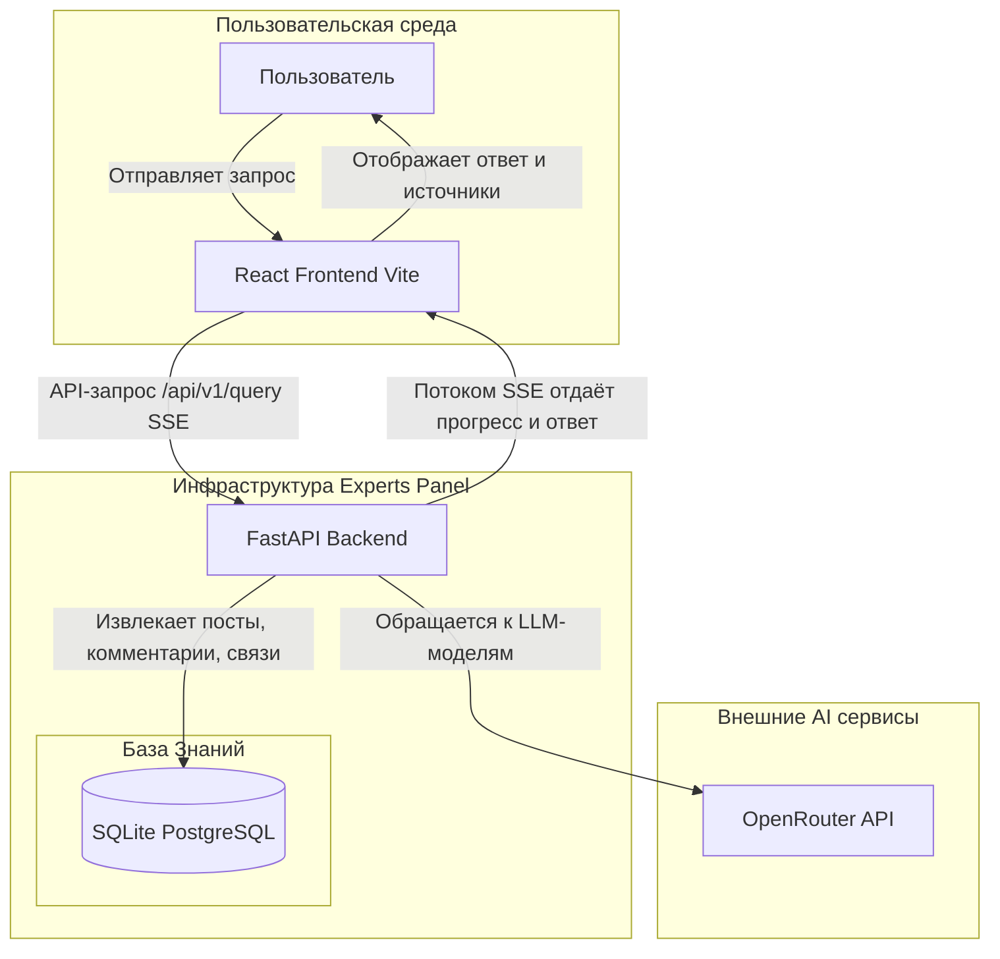
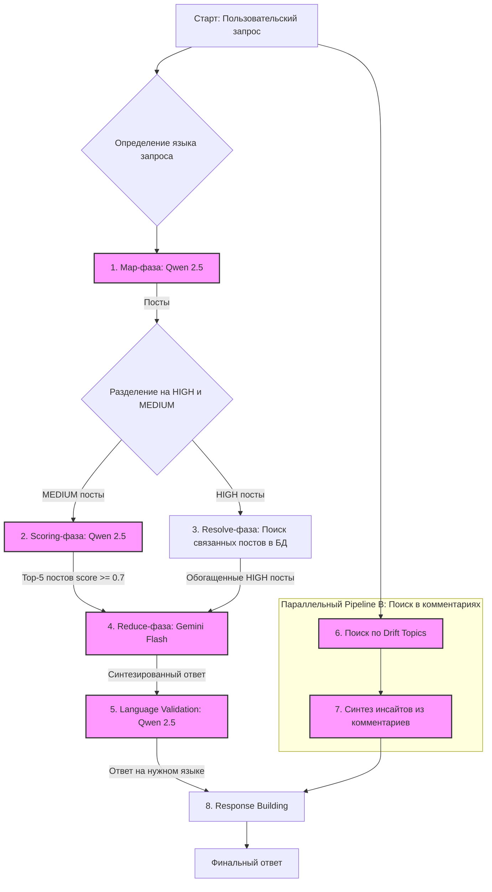
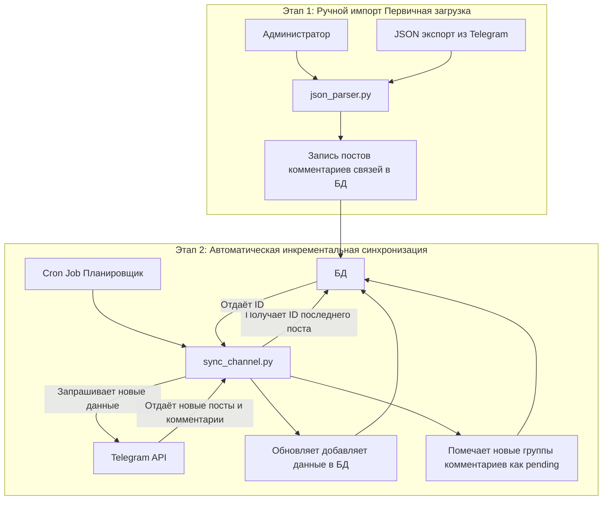
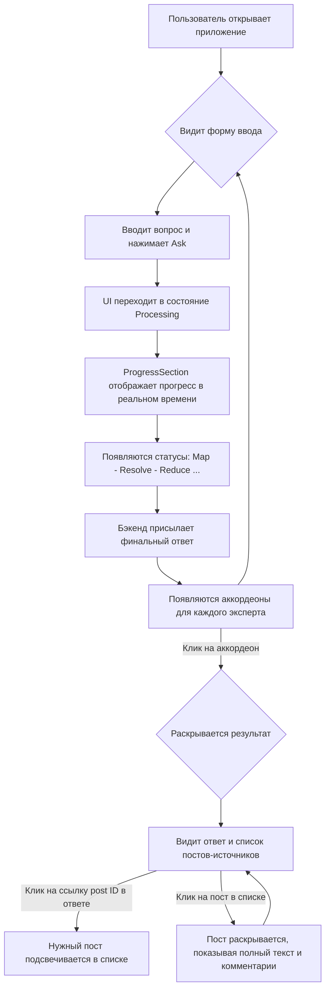
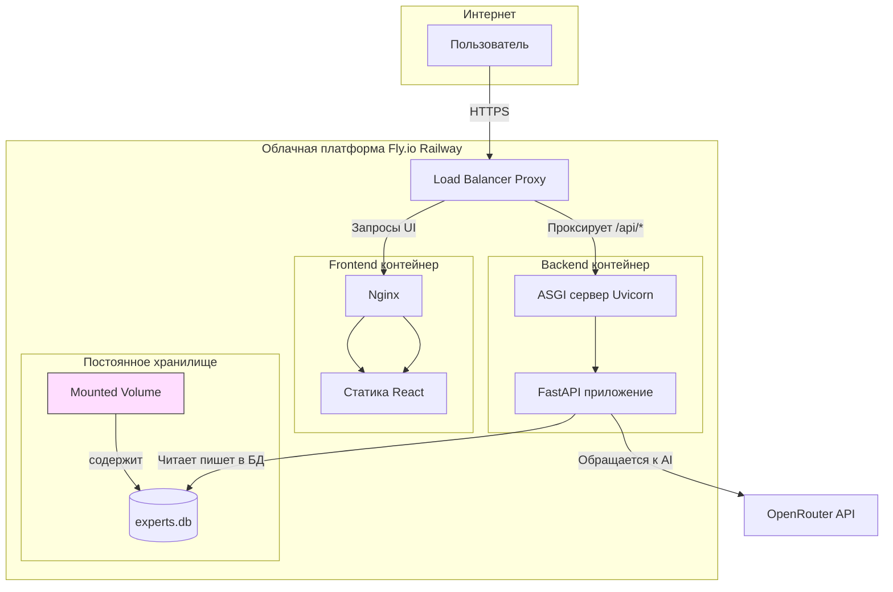

# Experts Panel

[](https://github.com/andreysazonov/Experts_panel/actions)
[](LICENSE)
[](https://python.org)
[](https://fastapi.tiangolo.com)
[](https://reactjs.org)

**Интеллектуальная система анализа Telegram каналов экспертов с использованием многомодельной AI-архитектуры**

Experts Panel — это мощный инструмент для семантического поиска и анализа контента из Telegram каналов экспертов. Система использует продвинутую **8-фазную архитектуру Map-Resolve-Reduce pipeline** с несколькими AI-моделями для предоставления точных и контекстуально релевантных ответов.

## 🏗️ Архитектура системы

### Высокоуровневая архитектура



### Интеллектуальный конвейер обработки запросов



### Жизненный цикл данных



### Пользовательский путь



### Архитектура развёртывания



## ✨ Ключевые возможности

- **🧠 8-фазная Map-Resolve-Reduce архитектура**: Продвинутый pipeline с дифференциальной обработкой HIGH/MEDIUM постов
- **🎯 Многомодельная AI-стратегия**: Qwen 2.5-72B (Map+Validation), Gemini 2.0 Flash (Reduce+Synthesis), GPT-4o-mini (Scoring+Matching)
- **🔍 Умный семантический поиск**: Находит релевантные посты по смыслу, а не по ключевым словам
- **📊 Medium Posts Hybrid Reranking**: Гибридная система с порогом ≥0.7 и топ-5 отбором
- **💬 Comment Drift Analysis**: Отдельный pipeline для анализа комментариев и обсуждений
- **🌐 Language Validation Phase**: Валидация языка ответа и перевод RU→EN при необходимости
- **⚡ Реальное время**: Отображение прогресса обработки через Server-Sent Events
- **👥 Мульти-экспертность**: Поддержка `expert_id` для изоляции данных и параллельной обработки
- **🔄 Автоматическая синхронизация**: Инкрементальное обновление данных из Telegram каналов

## 🚀 Быстрый старт

### Требования

- Python 3.11+
- Node.js 18+
- OpenRouter API ключ

### Установка и запуск

```bash
# 1. Клонирование репозитория
git clone https://github.com/andreysazonov/Experts_panel.git
cd Experts_panel

# 2. Настройка переменных окружения
cp .env.example .env
# Отредактируйте .env, добавив OPENROUTER_API_KEY

# 3. Запуск бэкенда
cd backend
pip install -r requirements.txt
python3 -m uvicorn src.api.main:app --reload --port 8000

# 4. Запуск фроненда (в новом терминале)
cd frontend
npm install
npm run dev
```

Приложение будет доступно по адресу http://localhost:3001

## 🛠️ Управление данными

### Импорт данных из Telegram

```bash
# Импорт JSON файла с указанием expert_id
cd backend && python -m src.data.json_parser data/exports/channel.json --expert-id refat

# Интерактивное добавление комментариев
cd backend && python -m src.data.comment_collector

# Синхронизация Telegram канала
cd backend && python sync_channel.py --dry-run --expert-id refat
cd backend && python sync_channel.py --expert-id refat
```

### Анализ drift и база данных

```bash
# Анализ drift в комментариях (обязательно после реимпорта данных)
cd backend && python analyze_drift.py

# Управление базой данных
cd backend && python -m src.models.database  # Интерактивное управление (init/reset/drop)

# Создание и миграция SQLite базы
sqlite3 data/experts.db < schema.sql
sqlite3 data/experts.db < backend/migrations/001_create_comment_group_drift.sql
sqlite3 data/experts.db < backend/migrations/002_add_sync_state.sql
sqlite3 data/experts.db < backend/migrations/003_add_expert_id.sql
```

## 📚 Использование API

### Базовый запрос

```bash
curl -X POST http://localhost:8000/api/v1/query \
  -H "Content-Type: application/json" \
  -d '{"query": "Ваш вопрос", "stream_progress": false}'
```

### Запрос к конкретному эксперту

```bash
curl -X POST http://localhost:8000/api/v1/query \
  -H "Content-Type: application/json" \
  -d '{"query": "Ваш вопрос", "expert_filter": ["refat"], "stream_progress": false}'
```

### Переменные окружения

```bash
# Основные переменные
OPENROUTER_API_KEY=your-key-here
DATABASE_URL=sqlite:///data/experts.db

# Medium Posts Reranking
MEDIUM_SCORE_THRESHOLD=0.7
MEDIUM_MAX_SELECTED_POSTS=5
MEDIUM_MAX_POSTS=50

# Производительность
MAX_POSTS_LIMIT=500
CHUNK_SIZE=20
REQUEST_TIMEOUT=300
```

## 🏗️ Техническая архитектура

### Технологический стек

- **Backend**: FastAPI, SQLAlchemy 2.0, Pydantic v2
- **Frontend**: React 18, TypeScript, Vite
- **Database**: SQLite / PostgreSQL с полной `expert_id` изоляцией
- **AI Models**: OpenRouter API (Qwen 2.5-72B, Gemini 2.0 Flash, GPT-4o-mini)
- **Deployment**: Docker, Fly.io

### Структура проекта

```
backend/
├── src/
│   ├── models/       # SQLAlchemy модели с expert_id полями
│   ├── services/     # Map-Resolve-Reduce pipeline
│   │   ├── medium_scoring_service.py    # Medium Posts Reranking
│   │   ├── language_validation_service.py # Language Validation
│   │   └── drift_analysis_service.py    # Comment Drift Analysis
│   ├── api/          # FastAPI эндпоинты
│   ├── data/         # Импорт и парсинг Telegram данных
│   └── utils/        # Утилиты и конвертеры
├── prompts/          # LLM промпты (оптимизированные под модели)
├── migrations/       # Миграции БД с expert_id поддержкой
└── tests/            # Тесты валидации

frontend/
├── src/
│   ├── components/   # React компоненты с expertId поддержкой
│   ├── services/     # API клиент с SSE стримингом
│   └── types/        # TypeScript интерфейсы
└── public/           # Статика

data/
├── exports/          # Telegram JSON файлы по expert_id
└── experts.db        # SQLite база данных с мульти-экспертностью
```

### Мульти-экспертная архитектура

- **Полная изоляция данных**: Каждый пост, комментарий и результат анализа имеет `expert_id`
- **Параллельная обработка**: Все эксперты обрабатываются одновременно для снижения времени ответа
- **Масштабируемость**: Лёгкое добавление новых Telegram каналов через `expert_id`
- **SSE трекинг**: Отображение активных экспертов в реальном времени через progress events

## 🚀 Продакшен развёртывание

### Развертывание на Fly.io

```bash
# 1. Установка Fly CLI
curl -L https://fly.io/install.sh | sh
fly auth login

# 2. Деплой приложения
fly deploy

# 3. Настройка секретов
fly secrets set OPENROUTER_API_KEY=your-key-here

# 4. Проверка здоровья
curl https://experts-panel.fly.dev/health
```

## 📖 Документация

- [Pipeline Architecture](docs/pipeline-architecture.md)
- [Multi-Expert Setup](docs/multi-expert-guide.md)
- [API Documentation](http://localhost:8000/docs)
- [Development Guide](docs/development-guide.md)

## 🤝 Вклад в проект

1. Fork репозитория
2. Создайте feature branch (`git checkout -b feature/AmazingFeature`)
3. Commit изменения (`git commit -m 'Add some AmazingFeature'`)
4. Push в branch (`git push origin feature/AmazingFeature`)
5. Откройте Pull Request

## 📄 Лицензия

Этот проект лицензирован под MIT License - см. файл [LICENSE](LICENSE) для деталей.

## 🙏 Благодарности

- [OpenRouter](https://openrouter.ai/) за доступ к передовым AI моделям
- [FastAPI](https://fastapi.tiangolo.com/) за мощный фреймворк
- [React](https://reactjs.org/) за прекрасный UI фреймворк

---

**Experts Panel** — превращаем хаос Telegram каналов в структурированные знания 💡