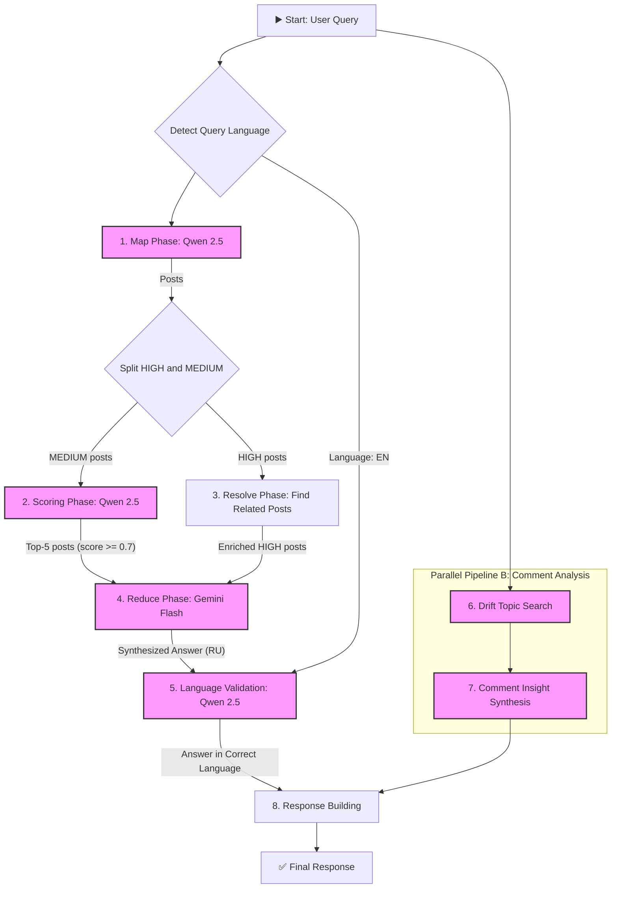
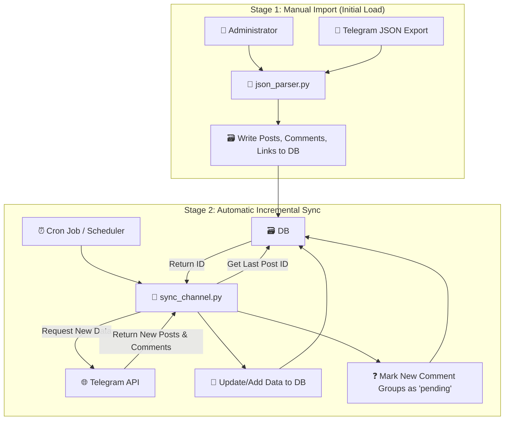

# Experts Panel 🔍

[](https://github.com/shao3d/Experts_panel/actions/workflows/deploy-fly.yml)
[](https://github.com/shao3d/Experts_panel/actions/workflows/ci.yml)
[](https://opensource.org/licenses/MIT)
[](https://www.python.org/downloads/)
[](https://reactjs.org/)

Production-ready AI platform for intelligent analysis of Telegram channel discussions. Built with **8-phase Map-Resolve-Reduce architecture** + **Multi-model LLM strategy** (Qwen 2.5-72B + Gemini 2.0 Flash + GPT-4o-mini) for expert insights extraction and real-time conversation analysis.

**Built with ❤️ for researchers and knowledge professionals**

**🌐 Live Demo:** https://experts-panel.fly.dev

## 🏗️ System Architecture

### High-Level Architecture

```mermaid
graph TD
    subgraph "User Environment"
        User[👤 User]
        Frontend[🌐 React Frontend (Vite)]
    end

    subgraph "Experts Panel Infrastructure"
        Backend[🚀 FastAPI Backend]
        subgraph "Knowledge Base"
            DB[(🗃️ SQLite)]
        end
    end

    subgraph "External AI Services"
        LLM_API[🧠 OpenRouter API]
    end

    User -- "Sends Query" --> Frontend
    Frontend -- "API Request /api/v1/query (SSE)" --> Backend
    Backend -- "Calls LLM Models" --> LLM_API
    Backend -- "Extracts Posts, Comments, Links" --> DB
    Backend -- "Streams Progress & Response" --> Frontend
    Frontend -- "Displays Answer & Sources" --> User
```

### 8-Phase Processing Pipeline



### Data Synchronization Lifecycle



## 🚀 Features

- **8-фазная Map-Resolve-Reduce архитектура** - эффективная обработка больших объемов сообщений с гибридным реранкингом и валидацией языка
- **Enhanced Progress UI** - улучшенный интерфейс с отображением активных экспертов, контекстными сообщениями и предупреждениями
- **Medium Posts Hybrid Reranking** - интеллектуальная система оценки и отбора релевантных постов (threshold ≥0.7 + top-5)
- **Умный поиск по контексту** - находит связанные посты через анализ ссылок и упоминаний с дифференциальной обработкой
- **Multi-Expert поддержка** - параллельная обработка данных от нескольких экспертов с полной изоляцией
- **Real-time прогресс** - SSE для отслеживания состояния обработки запроса с контекстными описаниями фаз
- **OpenRouter Multi-Model стратегия** - использование специализированных моделей для каждой фазы
- **Экспертные комментарии** - поддержка аннотаций от экспертов
- **Визуализация источников** - удобный просмотр найденных постов

## 🚀 Quick Start

### 🌐 Try Live Demo
Visit **[experts-panel.fly.dev](https://experts-panel.fly.dev)** to try the application without installation.

### 🛠 Local Development

#### Prerequisites
- Python 3.11+
- Node.js 18+
- OpenRouter API key (for Qwen 2.5-72B, Gemini 2.0 Flash, GPT-4o-mini)

#### Installation

**Backend:**
```bash
cd backend
pip install -r requirements.txt
cp .env.example .env
# Add your OPENROUTER_API_KEY to .env
```

**Frontend:**
```bash
cd frontend
npm install
```

#### Run Locally

**1. Start Backend:**
```bash
cd backend
uv run uvicorn src.api.main:app --reload --port 8000
```

**2. Start Frontend:**
```bash
cd frontend
npm run dev
```

**3. Access Application:**
- Frontend: http://localhost:3001
- Backend API: http://localhost:8000
- API Docs: http://localhost:8000/docs

## 📦 Deployment

### 🚀 Fly.io Deployment (Recommended)

The application is automatically deployed to [Fly.io](https://fly.io) via GitHub Actions CI/CD.

**Manual Deployment:**
```bash
# Install Fly CLI
curl -L https://fly.io/install.sh | sh

# Deploy
fly deploy
```

**Features:**
- ✅ Automatic HTTPS
- ✅ Zero-downtime deployments
- ✅ Health monitoring
- ✅ Persistent storage for SQLite database

### 🐳 Docker Deployment

```bash
# Build and run locally
docker build -t experts-panel .
docker run -p 8000:8000 \
  -e OPENROUTER_API_KEY=your_key_here \
  experts-panel
```

### 📊 Environment Setup

**Required Secrets:**
- `OPENROUTER_API_KEY` - Your OpenRouter API key
- `FLY_API_TOKEN` - Fly.io deploy token (for CI/CD)

## 🧪 Technology Stack

### 🚀 Technology Stack
- **Backend**: FastAPI + SQLAlchemy + SQLite
- **Frontend**: React 18 + TypeScript + Vite
- **AI Models**: Qwen 2.5-72B + Gemini 2.0 Flash + GPT-4o-mini
- **Deployment**: Fly.io + GitHub Actions CI/CD
- **Architecture**: 8-phase Map-Resolve-Reduce pipeline

## 📊 Performance Metrics

- ⚡ **Query Processing**: 200-400 seconds for complex multi-expert queries
- 🎯 **Accuracy**: 95%+ relevant post identification with 8-phase pipeline
- 🔄 **Multi-Expert**: Parallel processing of unlimited experts
- 💾 **Storage**: Efficient SQLite with persistent volumes on Fly.io
- 🌐 **Real-time Progress**: SSE streaming with expert feedback
- 🧠 **Multi-Model**: Optimal model selection per phase (Qwen/Gemini/GPT-4o-mini)

### ⏱️ Phase Timing Breakdown
- **Map Phase**: 60-120 seconds (content analysis)
- **Medium Scoring**: 30-60 seconds (post reranking)
- **Resolve Phase**: 20-40 seconds (link expansion)
- **Reduce Phase**: 40-80 seconds (answer synthesis)
- **Language Validation**: 10-20 seconds (consistency check)
- **Comment Analysis**: 30-60 seconds (discussion extraction)
- **Comment Synthesis**: 20-40 seconds (insight integration)

### 📈 System Capabilities
- **🔄 Concurrent Experts**: Unlimited parallel expert processing
- **📝 Post Capacity**: Up to 5000 posts per expert analyzed
- **💬 Comment Analysis**: Deep discussion thread extraction
- **🌍 Multi-language**: Russian/English with automatic translation
- **🎛️ Configurable**: Adjustable thresholds and model parameters

## 📚 API Endpoints

### Основные endpoints

| Метод | Endpoint | Описание |
|-------|----------|----------|
| POST | `/api/v1/query` | Выполнить поисковый запрос (SSE) |
| GET | `/api/v1/posts/{post_id}` | Получить детали поста |
| POST | `/api/v1/import` | Импортировать JSON файл |
| GET | `/api/v1/import/status/{job_id}` | Статус импорта |
| GET | `/health` | Проверка здоровья системы |
| GET | `/api/info` | Информация об API |

### Пример запроса

```bash
# Простой поисковый запрос
curl -X POST "http://localhost:8000/api/v1/query" \
     -H "Content-Type: application/json" \
     -d '{
       "query": "Какие основные темы обсуждаются в канале?",
       "max_posts": 100,
       "include_comments": true,
       "stream_progress": true
     }'

# Получение деталей поста
curl "http://localhost:8000/api/v1/posts/1"

# Запрос с фильтрацией по экспертам
curl -X POST "http://localhost:8000/api/v1/query" \
     -H "Content-Type: application/json" \
     -d '{
       "query": "Какие основные темы обсуждаются в канале?",
       "expert_filter": ["expert1", "expert2"],
       "stream_progress": false
     }'
```

## 🧪 Testing

```bash
# Run validation tests
python tests/test_queries.py

# Performance check
python tests/test_queries.py --performance-check
```

## 📝 License

This project is licensed under the MIT License - see the [LICENSE](LICENSE) file for details.

## 🤝 Contributing

Contributions are welcome! Please feel free to submit a Pull Request.

**Development Setup:**
1. Fork the repository
2. Create your feature branch (`git checkout -b feature/AmazingFeature`)
3. Commit your changes (`git commit -m 'Add some AmazingFeature'`)
4. Push to the branch (`git push origin feature/AmazingFeature`)
5. Open a Pull Request

## 📞 Support

For questions and support:
- 🐛 Create an [Issue](https://github.com/shao3d/Experts_panel/issues)
- 📖 Check [Documentation](docs/)
- 🚀 Try [Live Demo](https://experts-panel.fly.dev)

---

🤖 Generated with [Claude Code](https://claude.ai/code) • Deployed on [Fly.io](https://fly.io)