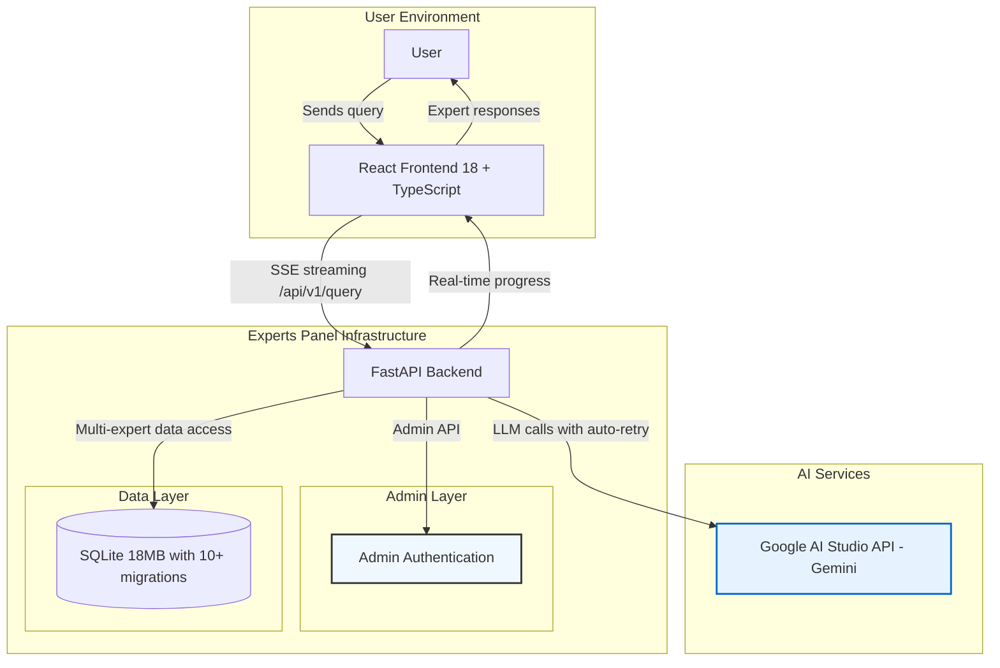
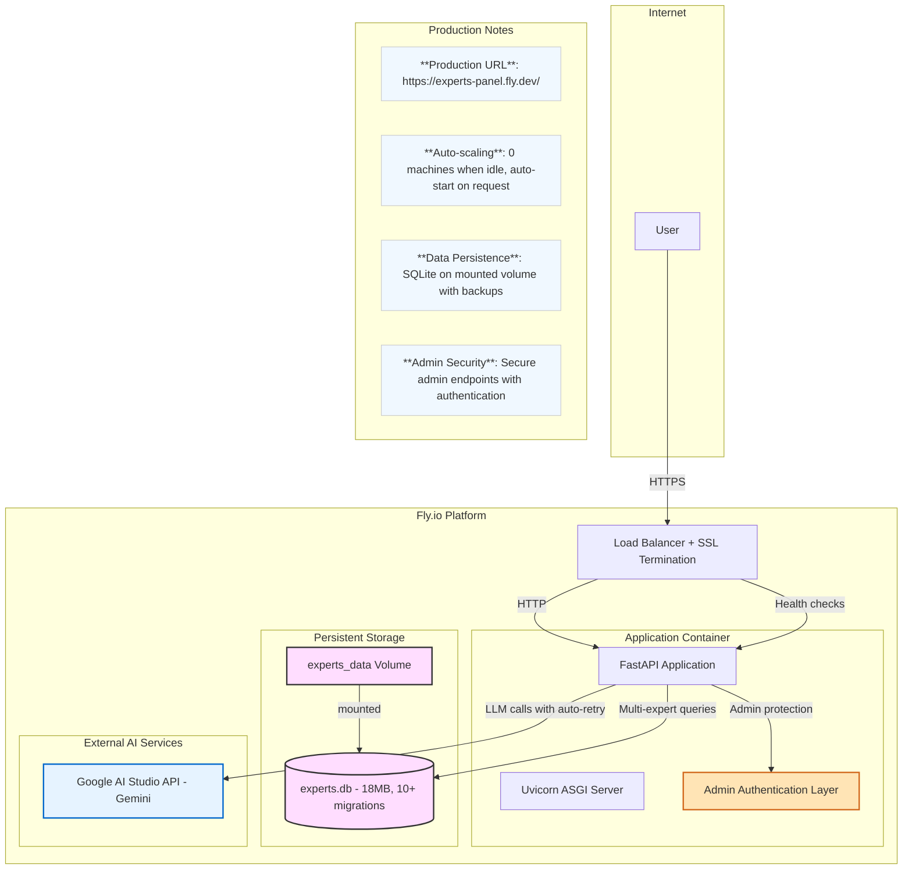

# Experts Panel

[](https://github.com/andreysazonov/Experts_panel/actions)
[](LICENSE)
[](https://python.org)
[](https://fastapi.tiangolo.com)
[](https://reactjs.org)

**Intelligent system for analyzing expert Telegram channels using Google Gemini AI**

Experts Panel is a powerful tool for semantic search and analysis of content from expert Telegram channels. The system uses an advanced **8-phase Map-Resolve-Reduce pipeline architecture** with Google Gemini AI to provide accurate and contextually relevant answers.

## 🏗️ System Architecture

The system uses an advanced **eight-phase Map-Resolve-Reduce pipeline** to provide accurate and contextually relevant answers. The architecture includes cost-optimized Gemini-only strategy with auto-retry on rate limits, differential processing for posts based on relevance, and parallel pipelines for content and comment analysis.

For a detailed breakdown of the 8-phase pipeline, component responsibilities, data flow, and model strategy, please see the **[Pipeline Architecture Guide](docs/pipeline-architecture.md)**.

### High-Level Architecture



### Intelligent Query Processing Pipeline


### Deployment Architecture



## ✨ Key Features

- **🧠 8-phase Map-Resolve-Reduce Architecture**: Advanced pipeline with differential HIGH/MEDIUM posts processing
- **🎯 Cost-Optimized Gemini Strategy**: Google AI Studio with Tier 1 account (high rate limits)
- **🔍 Smart Semantic Search**: Finds relevant posts by meaning, not keywords
- **📊 Medium Posts Reranking**: Gemini-based scoring system with threshold ≥0.7 and top-5 selection
- **💬 Comment Groups & Synthesis**: Gemini pipeline for comment drift analysis and insights extraction
- **🌐 Language Validation**: Response language validation and translation when needed
- **⚡ Real-time**: Processing progress display via Server-Sent Events with error handling
- **👥 Multi-expert Support**: Complete data isolation with `expert_id` and parallel processing
- **🔄 Dynamic Expert Loading**: Experts loaded from database with metadata centralization
- **🔒 Production Ready**: Admin authentication, security hardening with API key masking and robust error handling

## 🚀 Quick Start

### Prerequisites

- Python 3.11+
- Node.js 18+
- Google AI Studio API key(s) — get from https://aistudio.google.com/app/apikey

For a guided setup experience, execute the `quickstart.sh` script located in the project root. This script will check for dependencies, install packages for the frontend and backend, and create the necessary configuration files. After running the script, follow the final instructions it provides to start the backend and frontend servers.

## 🛠️ Data Management

The project includes several scripts for data management, located in the `backend/` directory.

### Automated Production Update (Recommended)
To synchronize all experts, run drift analysis, and deploy the updated database to production in one go, use the master script:
```bash
./scripts/update_production_db.sh
```
This script handles:
1. Local backup
2. Incremental Telegram Sync
3. AI-powered Drift Analysis (using Google Gemini)
4. Secure database upload (compressed)
5. Server restart

### Manual Data Operations
For specific tasks, you can use individual scripts:
- **Import**: `src.data.json_parser` for initial data import
- **Sync**: `backend/sync_channel.py` for single-channel sync
- **Drift**: `backend/analyze_drift.py` for drift analysis
- **Database**: `backend/src/models/database` for interactive management

### Drift Analysis and Database
Comment drift analysis is automatically handled by the production update script. For manual runs, use `backend/analyze_drift.py`. The initial database schema is defined in `schema.sql`, and migrations are in `backend/migrations/`.

## 📚 API Usage

The backend provides a RESTful API for querying experts and managing data. For detailed information on all available endpoints, request/response models, and to interact with the API directly, please see the auto-generated OpenAPI (Swagger) documentation.

When the backend server is running, the interactive API documentation is available at the `/api/docs` endpoint (e.g., `http://localhost:8000/api/docs`).

### Environment Variables

All configuration for the application is managed via environment variables. A complete list of available variables, along with default values for development, can be found in the `.env.example` file in the project root.

To set up your local environment, copy this file to `.env` and fill in the required values.

**Model Strategy Notes:**
- **Cost Optimization**: Using Google AI Studio Tier 1 paid account with high rate limits
- **Auto-Retry**: Automatic 65-second wait and retry on rate limit (429) errors
- **No Fallback Required**: Gemini-only strategy eliminates need for paid fallback services
- **Development Mode**: Set `ENVIRONMENT=development` to see masked API keys in logs

## 🏗️ Technical Architecture

### Technology Stack

- **Backend**: FastAPI, SQLAlchemy 2.0, Pydantic v2, uvicorn, Google AI Studio client with auto-retry
- **Frontend**: React 18, TypeScript, Vite, React Query, React Hot Toast, Tailwind CSS
- **Database**: SQLite (18MB) with 10+ migrations, full `expert_id` isolation and persistent volumes
- **AI Models**: Gemini-only strategy — Gemini 2.5 Flash Lite for Map phase, Gemini 3 Flash Preview for synthesis, Gemini 2.0 Flash for other phases, Gemini 3 Flash Preview for offline drift analysis
- **Deployment**: Docker, Fly.io with admin authentication, health checks and volume mounting

### Project Structure

```
backend/
├── src/
│   ├── models/       # SQLAlchemy models with expert_id fields
│   ├── services/     # 8-phase Map-Resolve-Reduce pipeline
│   │   ├── map_service.py                 # Map Phase (Gemini)
│   │   ├── medium_scoring_service.py      # Medium Posts Reranking (Gemini)
│   │   ├── simple_resolve_service.py      # Resolve Phase (depth 1)
│   │   ├── reduce_service.py              # Reduce Phase (Gemini)
│   │   ├── comment_group_map_service.py   # Comment Groups (Gemini)
│   │   ├── comment_synthesis_service.py   # Comment Synthesis (Gemini)
│   │   ├── google_ai_studio_client.py     # Google AI Studio Client (single-key with auto-retry)
│   │   ├── monitored_client.py            # LLM call monitoring wrapper
│   │   └── llm_monitor.py                 # LLM statistics and health tracking
│   ├── api/          # FastAPI endpoints
│   │   ├── main.py                        # Main application entrypoint
│   │   ├── simplified_query_endpoint.py   # Main Query Processing
│   │   └── admin_endpoints.py             # Admin Authentication
│   ├── data/         # Telegram data import and parsing
│   ├── utils/        # Utilities and enhanced error handling
│   └── config.py     # Hybrid model configuration
├── prompts/          # LLM prompts (optimized per model)
├── migrations/       # Database migrations (10+ migration files)
└── tests/            # Validation tests

frontend/
├── src/
│   ├── components/   # React components with real-time SSE progress
│   │   ├── ExpertAccordion.tsx            # Primary Expert UI Component
│   │   ├── ProgressSection.tsx            # Enhanced pipeline progress
│   │   ├── ExpertResponse.tsx             # Expert response rendering
│   │   └── QueryForm.tsx                  # User input form
│   ├── services/     # API client with SSE streaming
│   ├── types/        # TypeScript interfaces
│   └── utils/        # Utility functions
├── public/           # Static assets
└── package.json      # Dependencies: React Query, Hot Toast, etc.

data/
├── exports/          # Telegram JSON files by expert_id
├── experts.db        # SQLite database (18MB, 10+ migrations)
└── backend.log       # Backend API and pipeline logs
```

### Multi-Expert Architecture

- **Full Data Isolation**: Every post, comment, and analysis result has `expert_id` with complete separation
- **Parallel Processing**: All experts processed simultaneously to reduce response time
- **Scalability**: Easy addition of new Telegram channels via `expert_id`
- **SSE Tracking**: Real-time display of active experts via progress events
- **Resource Optimization**: Independent processing per expert with configurable filtering
- **Dynamic Discovery**: Automatic expert detection from database without hardcoding

## 🚀 Production Deployment

### Fly.io Deployment (15 minutes)

The application is configured for deployment on Fly.io. The configuration is defined in the `fly.toml` file.

To deploy, use the Fly.io CLI (`flyctl`). You will need to set the required secrets for API keys and other configurations as defined in `.env.example`. For detailed instructions on deploying and managing secrets, please refer to the official Fly.io documentation.

**Production Features:**
- ✅ **Auto-deployment**: Automatic deployment on push to main branch
- ✅ **Admin Authentication**: Secure admin endpoints with authentication
- ✅ **Health monitoring**: Built-in health checks with automatic restarts
- ✅ **Persistent data**: SQLite database (18MB) mounted on persistent volume
- ✅ **Security**: Non-root container, SSL termination, API key masking
- ✅ **Scalability**: Automatic scaling with 0 machines when idle
- ✅ **Cost Optimization**: Tier 1 paid account with high rate limits and auto-retry
- ✅ **Monitoring**: Real-time logs and deployment tracking

**Live Application**: https://experts-panel.fly.dev/

## 📚 Documentation

- [Pipeline Architecture](CLAUDE.md) - Complete 8-phase pipeline documentation
- [Backend Architecture](backend/CLAUDE.md) - FastAPI services and API reference
- [Frontend Development](frontend/CLAUDE.md) - React components and SSE integration
- [API Documentation](https://experts-panel.fly.dev/docs) - Interactive OpenAPI docs
- [Production Deployment](backend/CLAUDE.md#production-deployment) - Complete deployment guide
- [Prompts Library](backend/prompts/) - LLM prompts optimized per model

**Quick Links:**
- 🔧 **Development Setup**: [Quick Start Guide](#-quick-start)
- 🚀 **Production Deploy**: [Fly.io Guide](#-production-deployment-15-minutes)
- 📊 **Live Demo**: https://experts-panel.fly.dev/
- 🔍 **API Explorer**: https://experts-panel.fly.dev/docs

## 🤝 Contributing

1. Fork the repository
2. Create your feature branch (`git checkout -b feature/AmazingFeature`)
3. Commit your changes (`git commit -m 'Add some AmazingFeature'`)
4. Push to the branch (`git push origin feature/AmazingFeature`)
5. Open a Pull Request

## 📄 License

This project is licensed under the MIT License - see the [LICENSE](LICENSE) file for details.

## 🙏 Acknowledgments

- [Google AI Studio](https://aistudio.google.com/) for powerful Gemini models and Tier 1 rate limits
- [FastAPI](https://fastapi.tiangolo.com/) for the powerful framework
- [React](https://reactjs.org/) for the excellent UI framework

---

**Experts Panel** — turning Telegram channel chaos into structured knowledge 💡