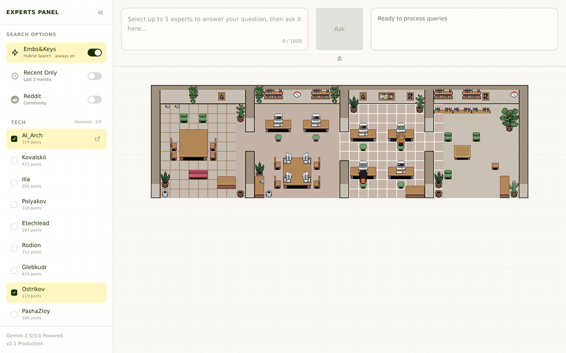
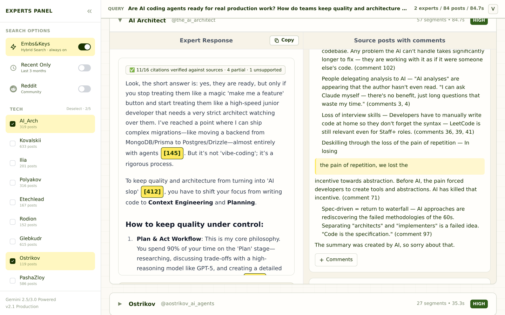
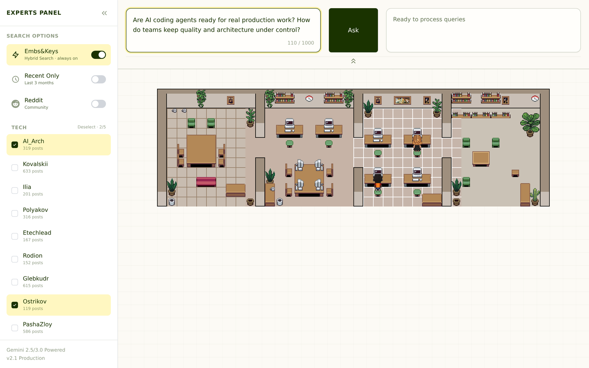
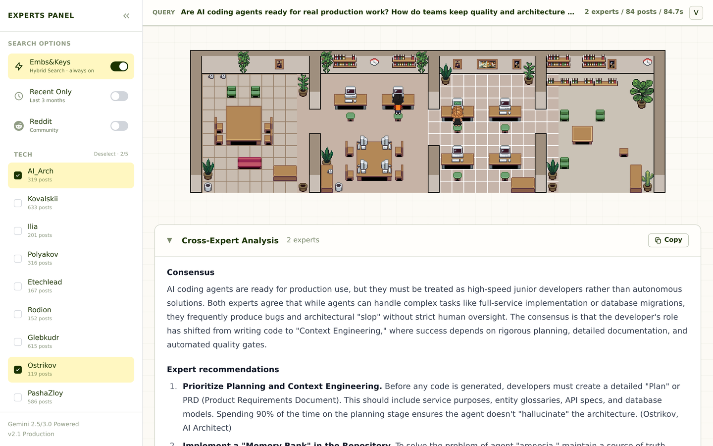
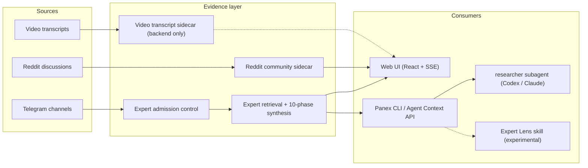
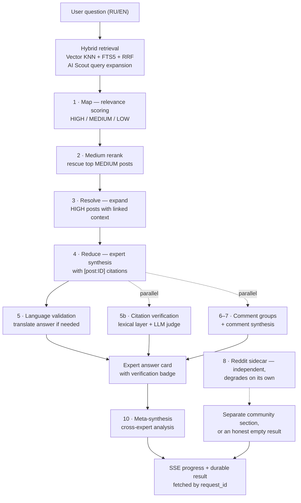
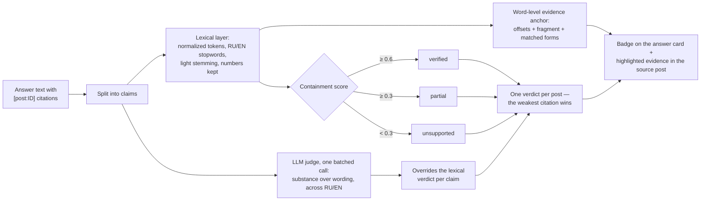

# Experts Panel

[](https://github.com/shao3d/Experts_panel/actions/workflows/ci.yml) [](LICENSE) [](https://www.python.org/) [](https://react.dev/)

**A source-grounded research system for comparing how practitioners think about AI and its application.**

Choose one or more experts, ask a question in English or Russian, and get an answer built from their actual published material rather than from a generic model persona. Experts Panel finds the relevant source fragments, analyzes each expert separately, and, when several experts are selected, produces a cross-expert synthesis without hiding disagreement.

[Open the live app](https://expa.beyondhorizon.dev/)

## See it in action



Every expert answer card carries a server-verified citations badge, and clicking any `[post:ID]` citation opens the source post with the exact supporting words highlighted:



| Ask a question | Cross-expert synthesis |
| --- | --- |
|  |  |

## What it does

- Searches curated expert corpora with hybrid retrieval: vector KNN, SQLite FTS5, and Reciprocal Rank Fusion.
- Runs a ten-phase Map–Resolve–Reduce pipeline per expert: relevance scoring, differential context expansion, synthesis with `[post:ID]` citations, and language validation.
- Keeps each expert's evidence isolated, then produces a cross-expert analysis that surfaces consensus, disagreement, and what only one expert mentioned.
- Verifies its own citations: every `[post:ID]` claim is checked against the cited post text (deterministic lexical layer plus a cheap LLM judge), and the answer card reports how many citations were confirmed.
- Answers in the language of the question, Russian or English. For English questions, cited posts, comments, and discussion groups are translated too, with citations kept clickable. Every translation is cached persistently so it is computed once ([Multilingual Support](docs/architecture/multilingual-support.md)).
- Runs a Video Hub transcript sidecar in the backend for video-based expert material; its sources are currently hidden from the web UI selection.
- Streams progress and results to the React interface over Server-Sent Events, and keeps every claim traceable to its source post.

## Community evidence sidecar

The Reddit path is a separate production sidecar, not another expert persona. It searches live discussions through Reddit OAuth, the Arctic Shift archive, and optional Google-ranked discovery, enriches promising threads with post bodies and comment trees, ranks them by whether they can actually answer the question, and synthesizes the surviving evidence with links back to Reddit. Comment budgets keep one large discussion from displacing the rest of the evidence, and a weak candidate set produces an honest empty result instead of a plausible filler answer.

The sidecar runs beside the expert pipeline and degrades independently: a Reddit timeout, unavailable discovery channel, or empty result never removes completed expert answers. The detailed behavior and current limitations are documented in [Reddit Integration](docs/architecture/reddit-service.md).

## More than the web interface

The same evidence layer powers three additional workflows beyond the web UI:

- **Panex** is an agent-facing bridge between an AI coding agent and the panel: a CLI (`panex`), an HTTP API ([Agent Context API](docs/architecture/agent-context-api.md)), and a read-only `experts_panel_researcher` subagent for Codex and Claude. It exposes two extraction levels. `expert_digest` is a source-backed expert digest, while `source_bundle` contains the full raw evidence for audit. `panex expand` reveals the exact sources behind a digest without rerunning the query ([Panex Usage](docs/guides/panex-usage.md)).
- **Expert admission control** decides who gets into the panel. Every candidate goes through a multi-stage review: a semantic value passport, a Knowledge Matrix of topical coverage, quantitative metrics (coverage gap closure, semantic overlap, source depth), and one of four verdicts: accept, reject, watchlist, or limited scope. The final call stays human ([Expert Admission Control](docs/architecture/expert-admission-control.md)).
- **Expert Lens** (experimental) is a Codex skill concept that requests a source-grounded second opinion on a bounded project question through one expert's corpus, without simulating the expert ([concept spec](docs/concepts/expert-lens-global-skill.md)).

These are intentionally bounded tools. Panex retrieves and structures expert evidence. It does not impersonate an expert or make project decisions on their behalf. The Knowledge Matrix supports admission review. It is not an automatic judge.

## Architecture at a glance

- **Backend:** FastAPI, SQLAlchemy, SQLite/FTS5, Google Gemini through OpenRouter.
- **Frontend:** React 18, TypeScript, Vite, Tailwind CSS, TanStack Query.
- **Retrieval:** Gemini embeddings, vector KNN, full-text search, RRF, and AI-assisted query expansion.
- **Community sidecar:** Node.js, Fastify, direct Reddit OAuth, Arctic Shift, optional Serper.dev discovery, comment enrichment, and answerability reranking.
- **Delivery:** SSE progress events plus durable result artifacts for long-running UI and agent requests.
- **Production:** Docker Compose on an Oracle VM behind Caddy, with GitHub Actions deployment and a post-deploy health check.


```mermaid
graph LR
    subgraph S["Sources"]
        TG["Telegram channels"]
        RD["Reddit discussions"]
        VH["Video transcripts"]
    end
    subgraph E["Evidence layer"]
        AC["Expert admission control"]
        EP["Expert retrieval + 10-phase synthesis"]
        RP["Reddit community sidecar"]
        VP["Video transcript sidecar (backend only)"]
    end
    subgraph C["Consumers"]
        UI["Web UI (React + SSE)"]
        PX["Panex CLI / Agent Context API"]
        SA["researcher subagent (Codex / Claude)"]
        EL["Expert Lens skill (experimental)"]
    end
    TG --> AC
    AC --> EP
    RD --> RP
    VH --> VP
    EP --> UI
    RP --> UI
    VP -.-> UI
    EP --> PX
    PX --> SA
    PX -.-> EL
```

The detailed pipeline is documented in [Pipeline Architecture](docs/architecture/pipeline.md). Hybrid retrieval is covered in [Super Passport Search](docs/architecture/super-passport-search.md).

### Query flow

Each selected expert runs the same pipeline in isolation, so answers never cross expert boundaries. Citation verification, comment analysis, and the Reddit sidecar all run in parallel with the main chain instead of stretching it:


```mermaid
flowchart TD
    Q["User question (RU/EN)"] --> H["Hybrid retrieval<br/>Vector KNN + FTS5 + RRF<br/>AI Scout query expansion"]
    H --> MAP["1 · Map — relevance scoring<br/>HIGH / MEDIUM / LOW"]
    MAP --> MED["2 · Medium rerank<br/>rescue top MEDIUM posts"]
    MED --> RES["3 · Resolve — expand<br/>HIGH posts with linked context"]
    RES --> RED["4 · Reduce — expert synthesis<br/>with [post:ID] citations"]
    RED --> LV["5 · Language validation<br/>translate answer if needed"]
    RED -. parallel .-> CV["5b · Citation verification<br/>lexical layer + LLM judge"]
    RED -. parallel .-> COM["6–7 · Comment groups<br/>+ comment synthesis"]
    LV --> RESP["Expert answer card<br/>with verification badge"]
    CV --> RESP
    COM --> RESP
    RESP --> META["10 · Meta-synthesis<br/>cross-expert analysis"]
    META --> SSE["SSE progress + durable result<br/>fetched by request_id"]
    RD["8 · Reddit sidecar — independent,<br/>degrades on its own"] -.-> ROUT["Separate community section,<br/>or an honest empty result"]
    ROUT --> SSE
```

### How citation verification works

The badge is not a self-report from the model that wrote the answer. Every claim with a `[post:ID]` citation is checked against the cited post by a deterministic lexical layer, then a cheap LLM judge refines the verdicts where wording alone is misleading:


```mermaid
flowchart LR
    ANS["Answer text with<br/>[post:ID] citations"] --> SPLIT["Split into claims"]
    SPLIT --> LEX["Lexical layer:<br/>normalized tokens, RU/EN stopwords,<br/>light stemming, numbers kept"]
    LEX --> SCORE{"Containment score"}
    SCORE -->|"≥ 0.6"| V["verified"]
    SCORE -->|"≥ 0.3"| P["partial"]
    SCORE -->|"< 0.3"| U["unsupported"]
    SPLIT --> JUDGE["LLM judge, one batched call:<br/>substance over wording, across RU/EN"]
    JUDGE --> OVR["Overrides the lexical<br/>verdict per claim"]
    LEX --> EV["Word-level evidence anchor:<br/>offsets + fragment + matched forms"]
    V --> POST["One verdict per post —<br/>the weakest citation wins"]
    P --> POST
    U --> POST
    OVR --> POST
    EV --> UI["Badge on the answer card +<br/>highlighted evidence in the source post"]
    POST --> UI
```

Verification runs on the pre-translation answer against the same post context the synthesizer saw; verdicts are keyed by source post ID, so they stay valid for the translated text. Fail-open: any error means no badge, never a false one.

## Production and data updates

Production runs on an Oracle VM behind Caddy. Docker Compose keeps the main application and Reddit proxy as separate services on the same private network. Every push to `main` triggers the `Deploy Experts Panel to Oracle` GitHub Actions workflow, which pulls the selected commit, rebuilds the services, and checks `/health` before the deployment is treated as successful.

The corpus has a separate release path because code deployment does not update production data. The VM-side maintenance pipeline synchronizes source material, applies migrations, builds embeddings, analyzes comment drift, validates a staged SQLite database, creates a backup, promotes the new database, restarts the application, and checks health. A rollback command restores the previous production database.

## Local development

Fastest path to a local stack:

```bash
./quickstart.sh
```

The script creates the backend virtualenv, installs Python and Node dependencies, scaffolds `backend/.env` from `.env.example`, and prepares an empty SQLite database. You still need to fill in `OPENROUTER_API_KEY` and import your own source data.

Manual setup, if you prefer:

Requirements:

- Python 3.11+
- Node.js 20+
- an OpenRouter API key
- a local SQLite corpus

Set up the backend:

```bash
python3 -m venv backend/.venv
source backend/.venv/bin/activate
pip install -r backend/requirements.txt
cp .env.example backend/.env
```

Fill in `OPENROUTER_API_KEY` and `DATABASE_URL` in `backend/.env`, then start the API:

```bash
cd backend
uvicorn src.api.main:app --reload --port 8000
```

In a second terminal, start the frontend:

```bash
cd frontend
npm ci
npm run dev
```

The frontend runs at `http://localhost:5173` and uses `http://localhost:8000` as the default development API.

Reddit search is optional. To run its direct OAuth sidecar locally, install and start the Fastify service:

```bash
cd services/reddit-proxy
npm ci
npm run dev
```

The sidecar `.env` requires `REDDIT_CLIENT_ID`, `REDDIT_CLIENT_SECRET`, `REDDIT_USERNAME`, `REDDIT_PASSWORD`, and a compliant `REDDIT_USER_AGENT`. Set `REDDIT_PROXY_URL=http://localhost:3000` for the local backend. `SERPER_API_KEY` is optional, and Arctic Shift discovery does not require a key.

The production corpus, Telegram sessions, OAuth credentials, API keys, and other secrets are not part of this repository. Use the root `.env.example` for backend settings and import your own source data for a populated local instance.

## Checks

```bash
cd backend
python -m pytest
```

```bash
cd frontend
npm run test:run
npm run build
```

```bash
cd services/reddit-proxy
npm run typecheck
npm run build
```

GitHub Actions also validates the backend, frontend build, and Docker configuration on pull requests and pushes to `main`.

## Technical documentation

Start with the [Documentation Map](docs/DOCUMENTATION_MAP.md) — it routes to the current SSOT for every subsystem. The per-topic entry points:

- [Pipeline Architecture](docs/architecture/pipeline.md)
- [Hybrid Retrieval](docs/architecture/super-passport-search.md)
- [Multilingual Support](docs/architecture/multilingual-support.md)
- [Panex Usage](docs/guides/panex-usage.md)
- [Agent Context API](docs/architecture/agent-context-api.md)
- [Expert Admission Control and Knowledge Matrix](docs/architecture/expert-admission-control.md)
- [Reddit Integration](docs/architecture/reddit-service.md)
- [Video Hub](docs/architecture/video-hub-service.md)

## License

This project is available under the [MIT License](LICENSE).
