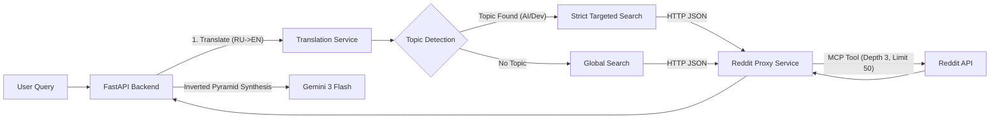

# Reddit Integration (Enhanced)

**Статус:** Production (Stable)
**Архитектура:** Sidecar Proxy Pattern
**Логика:** Smart Targeting + Deep Tree Analysis
**Дата обновления:** 07.02.2026

---

## 🏗️ Архитектура (Sidecar Proxy)

Система больше не использует прямой доступ к Reddit API из бэкенда (из-за проблем с блокировками IP дата-центров). Вместо этого используется микросервис-прокси с поддержкой глубокого анализа.



### Компоненты

1.  **Backend (`RedditEnhancedService`)**:
    *   Определяет тему запроса (AI, LLM, Dev, PM).
    *   Выбирает стратегию поиска (Strict vs Global).
    *   Отправляет запрос в прокси.
2.  **Proxy (`services/reddit-proxy`)**:
    *   Node.js + Fastify микросервис.
    *   **Round 3 Upgrade:** Качает дерево комментариев (Depth 3, Limit 50) для захвата дискуссий.
    *   Использует MCP (`reddit-mcp-buddy`) для надежного доступа к Reddit.
    *   Реализует поиск внутри сабреддитов через `search_reddit`.
3.  **Synthesis (`RedditSynthesisService`)**:
    *   **Inverted Pyramid:** Формирует ответ "Решение -> Детали -> Споры".
    *   **Freshness:** Учитывает текущую дату (2026) для фильтрации старья.
    *   **Critical Filter:** Отсеивает слухи и мемы.

---

## 🧠 Логика "Smart Targeting" (Strict Mode)

Это ключевой механизм, обеспечивающий качество ответов (Signal-to-Noise Ratio).

### 1. Детекция темы
Система анализирует запрос (и его английский перевод) на наличие ключевых слов.

| Категория | Ключевые слова (примеры) | Сабреддиты (Target) |
|-----------|--------------------------|---------------------|
| **AI / LLM** | `hallucination`, `rag`, `embedding`, `architect`, `weights`, `prompt`, `agent` | `LocalLLaMA`, `MachineLearning`, `OpenAI`, `claudeAI`, `deeplearning` |
| **Dev** | `python`, `rust`, `code`, `engineer`, `build`, `api` | `programming`, `webdev`, `coding`, `devops`, `AskEngineers` |
| **PM** | `specs`, `jira`, `requirements`, `scrum`, `agile`, `prd` | `ProductManagement`, `projectmanagement`, `agile` |

### 2. Режимы поиска (Mutual Exclusion)

В коде реализована жесткая логика взаимоисключения для борьбы с шумом:

*   **🔒 Strict Mode (Тема найдена):**
    *   Поиск **ТОЛЬКО** в целевых сабреддитах (например, `r/LocalLLaMA`).
    *   Глобальный поиск (`r/all`) **БЛОКИРУЕТСЯ**.
    *   *Причина:* Посты из `r/memes` или `r/pics` имеют рейтинг 50k+ и при сортировке вытесняют профильные посты (50-100 лайков). Блокировка решает эту проблему.
    
*   **🌍 Global Mode (Тема не найдена):**
    *   Поиск по всему Reddit (`r/all`).
    *   Используется только для общих запросов (новости, события), где нет специфической технической терминологии.

### 3. Fail-safe (Auto-detection)
Если вызывающий код (Endpoint) забыл передать список сабреддитов, сервис `RedditEnhancedService` **автоматически** запускает детектор тем внутри себя перед выполнением запроса. Это гарантирует, что Strict Mode работает всегда.

---

## 🛠️ Технические детали

### Файлы
- **Backend Service:** `backend/src/services/reddit_enhanced_service.py`
- **Proxy Service:** `services/reddit-proxy/src/index.ts`
- **Synthesis:** `backend/src/services/reddit_synthesis_service.py`

### Proxy API
```http
POST https://experts-reddit-proxy.fly.dev/search
Content-Type: application/json

{
  "query": "How to fight hallucinations?",
  "subreddits": ["LocalLLaMA", "MachineLearning"],
  "limit": 25,
  "sort": "relevance"
}
```

### Rate Limiting & Reliability
- **Circuit Breaker:** Встроен в бэкенд. Если прокси падает, сервис возвращает пустой результат, не ломая ответ эксперта.
- **Timeout:** 30 секунд (достаточно для "холодного старта" прокси).
- **Proxy Fix:** Прокси принудительно использует инструмент `search_reddit` (а не `browse_subreddit`), чтобы гарантировать поиск по ключевым словам внутри сообщества.

---

## 🚀 Deployment (CI/CD)

- **Backend:** Деплоится автоматически при изменениях в `backend/`.
- **Proxy:** Деплоится автоматически при изменениях в `services/reddit-proxy/` (отдельный workflow `deploy-reddit-proxy.yml`).

---

## 🔍 Troubleshooting

Если ответы кажутся нерелевантными (например, "Lego" вместо "System Architecture"):
1. **Проверьте перевод:** Бэкенд переводит запрос на EN. Если перевод плохой ("building" вместо "architecture"), ключевые слова могут не сработать.
2. **Проверьте ключевые слова:** Добавьте новые термины в `SUBREDDIT_BY_TOPIC` и `topic_keywords` в файле `reddit_enhanced_service.py`.
3. **Strict Mode:** Убедитесь, что глобальный поиск (`Strategy 3`) не выполняется параллельно с целевым.