# Reddit Integration (Search V2)

**Статус:** Production (Precision-First V2)  
**Архитектура:** Sidecar Proxy Pattern  
**Логика:** AI Scout v2 + Precision-First Retrieval + Answerability Rerank  
**Дата обновления:** 21.04.2026

---

## Коротко

Reddit больше не работает в режиме "найти как можно больше и потом надеяться, что LLM всё разрулит".  
Текущая версия Reddit Search V2 предпочитает:

1. собрать небольшой, но более чистый candidate pool;
2. не запирать поиск в выбранных LLM сабреддитах;
3. подтянуть комментарии раньше;
4. ранжировать по answerability, а не по шумной популярности;
5. лучше вернуть меньше постов, чем подсунуть пользователю тематически похожий, но нерелевантный мусор.

---

## Архитектура

```mermaid
graph LR
    User[User Query] --> Backend[FastAPI Backend]
    Backend -- "1. Formulate Reddit EN query" --> QueryForm[Inline Gemini Prompt]
    QueryForm -- "2. Search plan" --> Scout[AI Scout v2]

    Scout -- "queries + subreddit hints + keywords" --> Retrieval[Precision-First Retrieval]
    Retrieval -- "POST /search" --> Proxy[Reddit Proxy Service]
    Proxy -- "search_reddit via MCP" --> Reddit[Reddit API]
    Reddit --> Proxy
    Proxy --> Retrieval

    Retrieval -- "top candidates" --> Enrich[Early /details enrichment]
    Enrich -- "post body + comments" --> Ranker[Answerability Rerank]
    Ranker -- "high-confidence posts only" --> Gemini[Reddit Synthesis]
```



---

## Основная идея V2

### 1. Scout больше не является жёстким gatekeeper

Scout всё ещё полезен, но его роль изменилась:

- он предлагает `subreddits`
- строит 2-3 `queries`
- подсказывает `keywords`
- определяет intent (`how_to`, `comparison`, `troubleshooting`, `news`, `discussion`)

Но backend **не считает эти сабреддиты обязательной истиной**.  
Если Reddit retrieval зациклить только в них, система слишком легко начинает пропускать реальные полезные треды.

### 2. Retrieval стал проще

V2 использует небольшой набор базовых стратегий:

- `literal_global_relevance`
- `expanded_global_relevance`
- `scout_global_relevance`
- `quality_global_top`
- `fresh_global_new` для troubleshooting/news
- маленький targeted-channel по 1-2 лучшим subreddit hints для узких `how_to`, `troubleshooting`, `comparison` intents

Это важно:

- V2 **не** возвращается к старому strict mode;
- но и не игнорирует хорошие community hints полностью;
- если Scout хорошо попал в `ollama`, `nginx`, `ClaudeAI`, `mcp`, backend может добавить маленький targeted retrieval без блокировки global search.

Для comparison intent добавляются отдельные comparison-oriented запросы, но без прежнего "монструозного" набора search hacks.

### 3. Ранний deep fetch

Раньше комментарии слишком поздно попадали в ranking.  
Теперь top-кандидаты проходят раннее enrichment через `POST /details`, чтобы финальный rerank видел:

- тело поста
- практические комментарии
- сигналы типа "это реально решило проблему"

### 4. Answerability-first rerank

Gemini оценивает не просто "тематически похоже", а:

- отвечает ли тред на вопрос пользователя
- есть ли config / setup / fix / benchmark / trade-off
- есть ли полезные комментарии практиков
- не является ли это новостью, self-promo или showcase-шумихой

### 5. Confidence thresholds

V2 умеет **не возвращать** слабые Reddit-результаты.

Если найденные посты:

- слишком adjacent
- не держат anchor terms
- не дают high-confidence answerability

то они отбрасываются. Это сознательный tradeoff в пользу precision.

---

## Компоненты

### Backend (`backend/src/services/reddit_enhanced_service.py`)

Отвечает за:

- query formulation и scout plan
- candidate generation
- дедупликацию
- раннее enrichment постов
- heuristic scoring
- AI rerank
- confidence filtering

Ключевые принципы:

- `precision > recall`
- `subreddits as hints, not gates`
- `comments matter before final rerank`
- `abstain > noisy fill`

### Proxy (`services/reddit-proxy`)

Sidecar на Node.js / Fastify.

Endpoints:

- `POST /search`
- `POST /details`

Что делает:

- ходит в Reddit через MCP
- нормализует JSON
- чистит контент
- сохраняет кодовые блоки и структуру текста

### Synthesis (`backend/src/services/reddit_synthesis_service.py`)

Берёт уже очищенный shortlist и делает Staff-Engineer synthesis:

- hidden gems
- minority reports
- practical takeaways
- no fluff

---

## Query Flow

### Шаг 1. Формулировка Reddit-запроса

Русский пользовательский запрос сначала превращается в короткий английский Reddit-friendly query.

Важно:

- named entities сохраняются
- тех. термины не "переводятся красиво", а остаются в рабочем виде
- формулировка делается под community-search, а не под SEO/web search

Пример:

`Как настроить MCP в Claude Code?`  
→ `Claude Code MCP server setup`

### Шаг 2. Scout Plan

Scout возвращает:

- `subreddits`
- `queries`
- `keywords`
- `intent`
- `time_filter`

V2 дополнительно санитизирует scout queries, чтобы LLM не тащил веб-поисковые артефакты вроде `site:reddit.com`, `r/...`, кавычек и boolean-шума.

### Шаг 3. Candidate Generation

Backend не полагается на одну "умную" query.  
Он строит компактный пул из нескольких search channels и потом объединяет результаты.

### Шаг 4. Heuristic Score

До LLM rerank у каждого поста считается precision-first score.

Сигналы:

- lexical overlap по `title/body/comments`
- target keywords
- answerability markers
- technical guide markers
- quality signal по `score/comments`
- penalties за promo/showcase/noise

Для comparison intent дополнительно учитываются:

- прямые anchor matches в `title/body`
- direct comparison markers (`vs`, `comparison`, `benchmark`, `migrated`, `overhead`)
- штрафы за случаи, когда якоря встречаются только в комментариях

Для `how_to` / `troubleshooting` V2 также аккуратно отсекает слишком общие anchor terms, чтобы слова вроде `reverse`, `proxy`, `setup`, `fix` не работали как ложные "жёсткие сущности".

### Шаг 5. Early Enrichment

Лучшие кандидаты получают `full_content` и top comments ещё до финального AI rerank.

### Шаг 6. AI Rerank

Gemini rerank получает:

- title
- preview/body
- top comment snippets
- strategy provenance
- anchor / comparison metadata

И ранжирует по answerability.

### Шаг 7. Confidence Filter

После rerank включается финальный фильтр:

- строгий threshold
- мягкий fallback threshold
- для comparison intent более жёсткий anchor/control gate

---

## Что улучшает V2

По сравнению со старой схемой:

- меньше зависимость от случайно выбранных сабреддитов
- меньше шумных "почти по теме" постов
- меньше popularity bias
- лучше качество на `how_to`, `best practices`, `comparison`
- возможность нормально дебажить retrieval через trace

---

## Debug / Evaluation

### Feature Flags

В `backend/src/config.py`:

- `REDDIT_SEARCH_V2_ENABLED`
- `REDDIT_SEARCH_DEBUG`
- `REDDIT_RERANK_CANDIDATES`
- `REDDIT_PRE_RERANK_ENRICH_LIMIT`
- `REDDIT_MIN_CONFIDENCE`
- `REDDIT_SOFT_CONFIDENCE`

Практический смысл:

- V2 можно дебажить и калибровать без ручного перебора каждого запроса;
- harness позволяет быстро увидеть, не стало ли "больше стратегий" ценой латентности;
- в одной из live-проверок дополнительный scout channel дал почти нулевой выигрыш, но разогнал latency до ~216s, поэтому он сознательно **не** был оставлен в runtime.

### Eval Harness

Для локального сравнения и regression-check используется:

```bash
python3 backend/scripts/eval_reddit_search_v2.py
```

Для одного запроса:

```bash
python3 backend/scripts/eval_reddit_search_v2.py --query "Claude Code MCP server setup"
```

Harness пишет:

- strategies used
- total candidates
- returned high-confidence posts
- debug trace
- top results с heuristic / ai / final score

---

## Ограничения

1. Reddit search сам по себе не является качественным эталоном.  
   Поэтому V2 оптимизируется не "под Reddit native search", а под релевантные Reddit-discussions.

2. Comparison intent остаётся самым сложным типом запроса.  
   Там легче всего поймать соседние benchmark/news посты.

3. Scout остаётся LLM-шагом.  
   V2 уменьшает его вред при промахах, но не убирает его полностью.

4. Узкие infra/how-to кейсы могут честно возвращать маленький shortlist.  
   Это лучше, чем заполнять выдачу смежными self-hosted / homelab тредами без прямого ответа.

---

## Файлы

- `backend/src/services/reddit_enhanced_service.py`
- `backend/src/services/reddit_synthesis_service.py`
- `services/reddit-proxy/src/index.ts`
- `backend/scripts/eval_reddit_search_v2.py`
- `backend/src/config.py`

Итог: Reddit Search V2 — это не "ещё больше AI-магии", а более строгий retrieval-пайплайн, где Scout только помогает, комментарии участвуют раньше, а нерелевантная выдача чаще отбрасывается вместо того, чтобы красиво синтезироваться.
