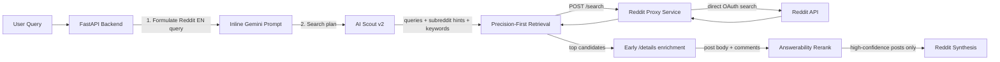

# Reddit Integration (Search V2)

**Status:** Production (Precision-First V2)  
**Architecture:** Sidecar Proxy Pattern  
**Logic:** AI Scout v2 + Precision-First Retrieval + Answerability Rerank  
**Last updated:** 23.08.2026

> **UI status:** The Reddit toggle is visible in the UI again (`REDDIT_SEARCH_VISIBLE = true` in `frontend/src/config/expertConfig.ts`, enabled on 24.08.2026). The sidecar runs on the VM (`http://reddit-proxy:3000`, docker compose service `reddit-proxy`); the URL is configured via `REDDIT_PROXY_URL` in `backend/src/config.py`. An honest V2 abstain (0 posts after the confidence filter) is marked as `skipped`, not as an error.

---

## Summary

Reddit no longer runs in "grab as much as possible and hope the LLM sorts it out" mode.  
The current version, Reddit Search V2, prefers to:

1. assemble a small but cleaner candidate pool;
2. not lock the search into Scout-selected LLM subreddits;
3. pull comments in earlier;
4. rank by answerability rather than by noisy popularity;
5. return fewer posts rather than feed the user topically adjacent but irrelevant junk.

---

## Architecture


```mermaid
graph LR
    User[User Query] --> Backend[FastAPI Backend]
    Backend -- "1. Formulate Reddit EN query" --> QueryForm[Inline Gemini Prompt]
    QueryForm -- "2. Search plan" --> Scout[AI Scout v2]

    Scout -- "queries + subreddit hints + keywords" --> Retrieval[Precision-First Retrieval]
    Retrieval -- "POST /search" --> Proxy[Reddit Proxy Service]
    Proxy -- "direct OAuth search" --> Reddit[Reddit API]
    Reddit --> Proxy
    Proxy --> Retrieval

    Retrieval -- "top candidates" --> Enrich[Early /details enrichment]
    Enrich -- "post body + comments" --> Ranker[Answerability Rerank]
    Ranker -- "high-confidence posts only" --> Gemini[Reddit Synthesis]
```

---

## The Main Idea of V2

### 1. Scout is no longer a hard gatekeeper

Scout is still useful, but its role has changed:

- it proposes `subreddits`
- builds 2-3 `queries`
- suggests `keywords`
- determines intent (`how_to`, `comparison`, `troubleshooting`, `news`, `discussion`)

But the backend **does not treat these subreddits as mandatory truth**.  
If Reddit retrieval is locked into them only, the system starts missing genuinely useful threads far too easily.

### 2. Retrieval got simpler

V2 uses a small set of base strategies:

- `literal_global_relevance`
- `expanded_global_relevance`
- `scout_global_relevance`
- `quality_global_top`
- `fresh_global_new` for troubleshooting/news
- a small targeted-channel pass over 1-2 best subreddit hints for narrow `how_to`, `troubleshooting`, `comparison` intents

This matters:

- V2 does **not** return to the old strict mode;
- but it does not fully ignore good community hints either;
- if Scout nailed `ollama`, `nginx`, `ClaudeAI`, `mcp`, the backend may add a small targeted retrieval without blocking global search.

For comparison intent, separate comparison-oriented queries are added, but without the former "monstrous" set of search hacks.

### 3. Early deep fetch

Previously, comments entered ranking too late.  
Now top candidates go through early enrichment via `POST /details`, so the final rerank sees:

- the post body
- practical comments
- signals such as "this actually solved the problem"

### 4. Answerability-first rerank

Gemini evaluates not just "topically similar" but:

- whether the thread answers the user's question
- whether there is config / setup / fix / benchmark / trade-off
- whether there are useful practitioner comments
- whether it is not news, self-promo, or showcase hype

### 5. Confidence thresholds

V2 knows how **not to return** weak Reddit results.

If the found posts:

- are too adjacent
- do not hold anchor terms
- do not give high-confidence answerability

then they are dropped. This is a deliberate tradeoff in favor of precision.

If the AI rerank call itself fails (LLM outage, exhausted provider balance),
the pipeline does **not** abstain on everything: candidates fall back to
heuristic scoring with a neutral AI component (0.5, the same value an unrated
post gets on a parse failure), so an outage degrades ranking quality — it
never turns real results into a false "nothing found". Scout and rerank LLM
calls also pass explicit `max_tokens` caps (1024/2048): their outputs are
small JSON plans, and bounded requests stay affordable for low OpenRouter
balances that reject the model-default 65536-token headroom with 402.

The final synthesis can also honestly abstain if the shortlist formally passed
ranking but collectively does not answer the question. Such a result is returned
as `abstained`, not as a contradictory `completed` with an empty answer.

`[S#]` citations are validated against the synthesis context that was actually passed.
Out-of-range indexes are removed from the answer with an explicit user notification.

---

## Components

### Backend (`backend/src/services/reddit_enhanced_service.py`)

Responsible for:

- query formulation and scout plan
- candidate generation
- deduplication
- early post enrichment
- heuristic scoring
- AI rerank
- confidence filtering

Key principles:

- `precision > recall`
- `subreddits as hints, not gates`
- `comments matter before final rerank`
- `abstain > noisy fill`

### Proxy (`services/reddit-proxy`)

A Node.js / Fastify sidecar.

Endpoints:

- `POST /search`
- `POST /details`

What it does:

- talks to Reddit directly via the OAuth API (search + details; the MCP layer was removed on 24.08.2026)
- reads `X-Ratelimit-*`, gates requests before the bucket is exhausted, backs off per `Retry-After` on 429
- normalizes JSON
- cleans content
- preserves code blocks and text structure

### Historical note: Google CSE

A channel based on the Custom Search JSON API was implemented and removed on 25.08.2026: Google closed the API
for new projects (service sunset 01.2027), and our project received 403 regardless of
configuration. Its role is now covered by `serp_google_discovery` (Serper.dev — the same
Google results, programmatically).

### Archive discovery (`arctic_targeted_archive`)

The Arctic Shift channel (a free mirror with live ingestion, lag of ~minutes): exhaustive
full-text search over `title` + `selftext` inside the Scout's top subreddits — it surfaces threads
that native search misses due to ranking quirks. Service limitation: text
search requires a subreddit. Freshness for `use_recent_only` is via the `after=90d` parameter.
Enabled by default (`ARCTIC_SHIFT_ENABLED`); degrades silently without network.

### Google ranking (`serp_google_discovery`)

The Serper.dev channel — programmatic access to the real Google results for `site:reddit.com`
(closing the hole left by the discontinued CSE: ranking + comment indexing + tolerance for
rephrasing). Snippet-only candidates get `created_utc` via a mandatory
`/details` enrichment; under `use_recent_only`, candidates with an old or still
unknown date are dropped. ≤10 results per call = 1 credit
(~$1/1000 queries, 2500 free tier). Without a `SERPER_API_KEY` the channel sleeps.

### Synthesis (`backend/src/services/reddit_synthesis_service.py`)

Takes the already cleaned shortlist and produces a Staff-Engineer synthesis:

- hidden gems
- minority reports
- practical takeaways
- no fluff

The answer is built decision-first: the brief conclusion and `КУДА ИДТИ` / `WHERE TO GO` (where to go) come before the Deep Dive, and sections have explicit length limits. A comparison table
is added only when there are at least two meaningful numeric rows.
Wording such as «консенсус» (consensus), «стандарт» (standard) and «смена тренда» (trend shift) is allowed only with
independent confirmation by at least two relevant sources, with both
links in the same statement.

**Synthesis backends (`REDDIT_SYNTH_BACKEND`):**

- `gemini` (default) — OpenRouter `MODEL_SYNTHESIS`, as before.
- `opencode` — headless opencode serve on the VM (`OPENCODE_URL`, systemd unit
  `opencode-serve.service`), free model `OPENCODE_SYNTH_MODEL`
  (`opencode/x-preview-f-free`). The client `opencode_synth_client.py` speaks plain
  HTTP (create session → sync prompt → abort/delete cleanup), without a local
  binary — it works from the panel container and from any machine with access to the VM.
  Any error/timeout → automatic fallback to Gemini.
- `auto` — opencode within `OPENCODE_SYNTH_TIMEOUT_S`, otherwise Gemini.
- `shadow` — the user gets Gemini; opencode runs in parallel
  fire-and-forget for `[shadow]` telemetry only (A/B on latency and quality).

opencode response validation: an honest abstain is accepted from any backend; everything else must
be ≥200 characters and contain a final «КУДА ИДИ» / `WHERE TO GO` block,
otherwise the answer is rejected → fallback. Concurrency is limited by
`OPENCODE_SYNTH_CONCURRENCY` (the serve is shared with drift workers).

**`auto` mode — head-start race:** the free model starts immediately; if it has not finished within
`OPENCODE_SYNTH_HEADSTART_S` (20s), Gemini joins the race
and the first ready answer wins (the loser is cancelled and its session is cleaned up).
Worst-case latency ≈ head-start + one Gemini call, not "full timeout +
Gemini" as with sequential fallback.

**Measurement of 26.08.2026 (the root of the slowness is neither zombies nor the server):** session+TTFT overhead ~10s, generation on x-preview-f-free ~7–12 tok/s → full synthesis
(~1.5–2k output tokens) consistently takes 79–90+s. Alternative free models
are faster (mimo-v2.5-free ~25 tok/s), but on the real prompt they truncate the final block;
nemotron-lightning times out. Conclusion: the interactive path remains `gemini`;
`shadow` measures quality/latency on live requests. opencode's niche is
non-interactive batches (drift).

**Serve session hygiene:** clients (`opencode_synth_client.py`,
`opencode_drift_client.py`) abort+delete their own sessions after completion.
The tail is cleaned up by the daily systemd timer `opencode-janitor.timer`
(script `backend/scripts/opencode_serve_janitor.py`, dry-run without `--apply`):
it kills sessions stuck in retry and deletes machine sessions older than 6h by
the prefixes drift_/driftb_/reddit_synth_/trans_/synth_/synthcl_/class_/parse_.

---

## Query Flow

### Step 1. Reddit query formulation

The Russian user query is first turned into a short English Reddit-friendly query.

Important:

- named entities are preserved
- platform/device, the user's goal, and the type of evidence sought are not lost
- technical terms are not "prettified in translation" but stay in working form
- the formulation targets community search, not SEO/web search
- formulation returns `search_query`, `user_intent` and `must_keep` anchors;
  the original question and anchors are passed on to Scout and rerank

Example:

`Как настроить MCP в Claude Code?` (How do I set up MCP in Claude Code?)  
→ `Claude Code MCP server setup`

### Step 2. Scout Plan

Scout returns:

- `subreddits`
- `queries`
- `keywords`
- `intent`
- `time_filter`

The intent taxonomy includes `recommendation`, `use_cases` and
`practitioner_examples`. For them, Scout looks for specific features, commands,
shortcuts and automations that people have actually assembled or use, not
general architecture on an adjacent topic.

V2 additionally sanitizes scout queries so the LLM does not drag in web-search artifacts like `site:reddit.com`, `r/...`, quotation marks and boolean noise.

### Step 3. Candidate Generation

The backend does not rely on a single "smart" query.  
It builds a compact pool from several search channels and then merges the results.

### Step 4. Heuristic Score

Before the LLM rerank, each post gets a precision-first score.

Signals:

- lexical overlap over `title/body/comments`
- target keywords
- answerability markers
- technical guide markers
- quality signal over `score/comments`
- penalties for promo/showcase/noise

Anti-spam layer (deterministic, only indisputable patterns):

- `SPAM_TITLE_PATTERNS`: credit mechanics (`gives you N`, `N free credits`,
  signup bonus/promo) — the base penalty grows with the number of matches
- the combination of "spam pattern + starved engagement" (score ≤3, comments ≤5)
  gets an additional penalty — this is almost certainly an ad
- subreddit reputation: an `seo` fragment in the name is a minus
- principle: patterns kill the obvious; the LLM judges the questionable

For comparison intent, additionally taken into account:

- direct anchor matches in `title/body`
- direct comparison markers (`vs`, `comparison`, `benchmark`, `migrated`, `overhead`)
- penalties for cases where anchors appear only in comments

For `how_to` / `troubleshooting`, V2 also carefully prunes overly generic anchor terms so that words like `reverse`, `proxy`, `setup`, `fix` do not act as false "hard entities".

### Step 5. Early Enrichment

The best candidates receive `full_content` and top comments even before the final AI rerank.

### Step 6. AI Rerank

The Gemini rerank receives:

- title
- preview/body
- top comment snippets
- strategy provenance
- engagement (`score`, `num_comments`) — an explicit signal so the judge can
  itself tell SEO bait apart from a fresh high-quality post
- anchor / comparison metadata
- the original user question, formulation intent and must-keep anchors

For `use_cases` / `practitioner_examples`, unambiguous job solicitations
(`For Hire`, `looking for work`) are cut off deterministically. First-person build reports
like `I built ...` are not automatically treated as spam: this is often the best
practitioner evidence.

The judge model depends on intent: comparison queries (a magnet for "vs"-bait)
are handled by `MODEL_SYNTHESIS`, the rest by the cheap `MODEL_ANALYSIS`.

And it ranks by answerability.

### Step 7. Confidence Filter

After the rerank, the final filter kicks in:

- a strict threshold
- a soft fallback threshold
- for comparison intent, a stricter anchor/control gate

---

## What V2 Improves

Compared to the old scheme:

- less dependence on randomly chosen subreddits
- fewer noisy "almost on topic" posts
- less popularity bias
- better quality on `how_to`, `best practices`, `comparison`
- the ability to debug retrieval properly via trace

---

## Debug / Evaluation

### Feature Flags

In `backend/src/config.py`:

- `REDDIT_SEARCH_DEBUG`
- `REDDIT_RERANK_CANDIDATES`
- `REDDIT_PRE_RERANK_ENRICH_LIMIT`
- `REDDIT_MIN_CONFIDENCE`
- `REDDIT_SOFT_CONFIDENCE`
- `REDDIT_SYNTH_COMMENT_TOP_K` — top-K root comments by score per source in synthesis
- `REDDIT_SYNTH_SOURCE_CHAR_CAP` — character cap per source (body + comment tree)
- `REDDIT_SYNTH_MAX_TOKENS` — synthesis output budget; on finish_reason=length, one automatic re-request with a 2x budget
- `REDDIT_SYNTH_BACKEND` — synthesis backend: gemini | opencode | auto | shadow (see the Synthesis section)
- `OPENCODE_URL`, `OPENCODE_SYNTH_MODEL`, `OPENCODE_SYNTH_TIMEOUT_S`, `OPENCODE_SYNTH_CONCURRENCY` — headless opencode serve parameters

Practical meaning:

- V2 can be debugged and calibrated without manually retrying every query;
- the harness quickly shows whether "more strategies" came at the cost of latency;
- in one of the live checks, an extra scout channel gave almost zero gain but pushed latency to ~216s, so it was deliberately **not** kept in runtime.

### Eval Harness

For local comparison and regression checks:

```bash
python3 backend/scripts/eval_reddit_search_v2.py
```

For a single query:

```bash
python3 backend/scripts/eval_reddit_search_v2.py --query "Claude Code MCP server setup"
```

The harness writes:

- strategies used
- total candidates
- returned high-confidence posts
- debug trace
- top results with heuristic / ai / final score

---

## Agent-facing API (`POST /api/v1/agent/reddit-search`)

**Status:** implemented (verified by contract tests locally/in CI); production
smoke — after an explicit `выкатывай` (release) command from the owner.

### Purpose

A stable programmatic entry point for other projects and AI agents that runs the **full
Reddit Search V2** (query formulation + AI Scout + several discovery channels +
enrichment + answerability rerank + confidence filtering + synthesis). This is **not**
an external exposure of `reddit-proxy`: the proxy only does OAuth search/details and
remains an internal sidecar; the network boundary does not change.

### Endpoint and authentication

```http
POST /api/v1/agent/reddit-search
Authorization: Bearer <REDDIT_SEARCH_API_TOKEN>
Content-Type: application/json
```

- Generic external clients receive separate Reddit-only tokens from
  `REDDIT_SEARCH_CLIENT_TOKENS` (comma-separated server env). They do not pass
  `verify_agent_context_token` and do not grant access to Panex / Agent Context API.
- The owner keeps backward compatibility: `AGENT_CONTEXT_API_TOKEN` is also
  accepted by this endpoint but is not distributed to external users.
- Rate limiting remains per-token, so clients do not share a single bucket.
- The timeout reuses `AGENT_CONTEXT_TIMEOUT_SECONDS` (synchronous
  `asyncio.wait_for`, the same pattern as Agent Context); timeout → `504`.

### Request

```json
{
  "query": "What do practitioners say about Claude Code hooks?",
  "use_recent_only": false
}
```

- `query`: 3–1000 characters; empty/too short/too long → `422`
  (global validation handler, `error=validation_error`).
- There are no other tuning parameters.

### Response (200)

```json
{
  "status": "completed",
  "query": "What do practitioners say about Claude Code hooks?",
  "answer": "Source-grounded synthesis",
  "sources": [
    {
      "title": "Discussion title",
      "url": "https://www.reddit.com/r/example/comments/example",
      "subreddit": "example"
    }
  ],
  "message": null,
  "found_count": 23,
  "processing_time_ms": 12345
}
```

- `sources` — only high-confidence posts that passed the confidence filter.
- `found_count` — the number of unique candidates that reached ranking
  (before the confidence filter); therefore it can be (and usually is) larger
  than the number of `sources`.

### Semantics

| Scenario | HTTP | status | answer / sources / message |
|---|---|---|---|
| V2 produced synthesis + high-confidence posts | 200 | `completed` | synthesis + real sources, `message=null` |
| After the confidence filter V2 has 0 posts left | 200 | `abstained` | `answer=null`, `sources=[]`, short `message` |
| proxy unavailable / pipeline exception | 502 | — | safe short `detail`, no internal error text |
| `AGENT_CONTEXT_TIMEOUT_SECONDS` exceeded | 504 | — | safe short `detail` |
| Query validation error | 422 | — | global validation handler (`error=validation_error`) |
| Token missing/invalid | 403 | — | same semantics as the Agent Context token |

A technical error is never returned as `200 + status="failed"`; the future CLI
maps such responses onto its own `failed` state and a non-zero exit code.

The response contains none of: chain-of-thought/hidden prompts, tokens/credentials/env,
internal stack traces, results from the experts/Telegram pipeline,
invented sources.

### Implementation and boundaries

- The endpoint lives in `backend/src/api/agent_context_endpoint.py` and, via
  `run_reddit_search_v2()` (`backend/src/api/simplified_query_endpoint.py`), goes into
  the same V2 pipeline as the Panel — there is no second copy of the pipeline.
- The shared entry `run_reddit_search_v2()` splits the result into three states:
  `completed` / `abstained` / `failed`; the Panel SSE path uses the same base
  logic via `process_reddit_pipeline`.
- `reddit-proxy:3000` remains an internal sidecar: the port is not published, the network
  boundary does not change.
- The synchronous model inherits the existing Agent Context timeout/response-size contracts; if a future real smoke shows that a synchronous response is unusable,
  extending the architecture will be discussed separately.

### CLI boundary (implemented, contract verified)

A minimal CLI/portable runner is implemented in `backend/src/cli/reddit_search.py`
(run: `python -m src.cli.reddit_search "..."`). It talks only to this API,
takes the URL/token from env (`REDDIT_SEARCH_API_URL` / `REDDIT_SEARCH_API_TOKEN`;
legacy owner fallback — `AGENT_CONTEXT_API_TOKEN`), and on macOS supports a
safe login-Keychain fallback for a dedicated Reddit-only token (service
`com.experts-panel.reddit-search`, account `reddit-search`),
never prints the token, distinguishes completed/abstained/failed and returns
a non-zero exit code only on a technical error (network error, 5xx, timeout,
missing token). abstained is exit 0 with a human-readable message.

```bash
python -m src.cli.reddit_search "What do practitioners say about Claude Code hooks?"
python -m src.cli.reddit_search "What changed in local LLMs" --recent
python -m src.cli.reddit_search --json "What changed in local LLMs"
python -m src.cli.reddit_search --doctor --api-url http://127.0.0.1:8000/api/v1/agent/reddit-search
```

- `--json` — stable machine-readable output of the raw API JSON response (exit 0).
- `--doctor` — checks `/health` reachability and token presence in env (the token is
  not required and not printed); exit 1 if the API is unreachable or unhealthy.
- The repository template of the global Codex skill lives in
  `.codex/skills/reddit-search/`; the portable runner and installer are in `scripts/`.
  Installation is performed separately into the user's `~/.codex` and `~/.local/bin`,
  without copying or printing the token.
- A universal package for third-party CLIs is built with
  `scripts/build_reddit_search_generic_client.sh`; the user guide is
  `docs/guides/reddit-search-generic-client.md`.
- The global Codex skill is not part of the production deploy: it is a local
  user-side installation on top of the already published API.

### Verification

- Contract tests: `backend/tests/test_agent_reddit_search.py` (auth, query
  boundaries, completed/abstained, upstream timeout/error, absence of stack
  traces/secrets, proof that the shared logic is used).
- Production proof after `выкатывай` (release): authenticated production smoke
  (real Reddit links) + smoke of the old Panel Reddit flow + confirmation that
  the production DB was not updated.

---

## Limitations

1. Reddit search by itself is not a quality ground truth.  
   Therefore V2 is optimized not "for Reddit native search" but for relevant Reddit discussions.

2. Comparison intent remains the hardest query type.  
   It is the easiest place to catch adjacent benchmark/news posts.

3. Scout remains an LLM step.  
   V2 reduces its harm on misses but does not remove it entirely.

4. Narrow infra/how-to cases may honestly return a small shortlist.  
   That is better than filling the results with adjacent self-hosted / homelab threads without a direct answer.

---

## Files

- `backend/src/services/reddit_enhanced_service.py`
- `backend/src/services/reddit_synthesis_service.py`
- `services/reddit-proxy/src/index.ts`
- `backend/scripts/eval_reddit_search_v2.py`
- `backend/src/config.py`
- `backend/src/api/simplified_query_endpoint.py` — `run_reddit_search_v2()` (shared three-state boundary) and `process_reddit_pipeline`
- `backend/src/api/agent_context_endpoint.py` — `POST /api/v1/agent/reddit-search`
- `backend/tests/test_agent_reddit_search.py` — API contract tests
- `backend/src/cli/reddit_search.py` — minimal CLI wrapper over the API
- `backend/tests/test_reddit_search_cli.py` — CLI contract tests
- `.codex/skills/reddit-search/SKILL.md` — global Codex skill instructions
- `.codex/skills/reddit-search/agents/openai.yaml` — skill metadata
- `scripts/reddit_search_runner.py` — portable stdlib-only runner
- `scripts/install_reddit_search_skill.sh` — safe installer for skill + runner
- `backend/tests/test_reddit_search_runner.py` — runner contract tests

Bottom line: Reddit Search V2 is not "even more AI magic" but a stricter retrieval pipeline, where Scout only assists, comments participate earlier, and irrelevant results are more often dropped instead of being beautifully synthesized.
