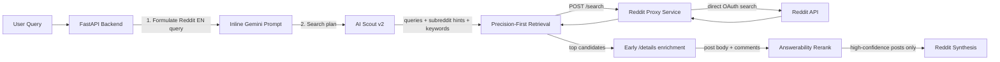

# Reddit Integration (Search V2)

**Статус:** Production (Precision-First V2)  
**Архитектура:** Sidecar Proxy Pattern  
**Логика:** AI Scout v2 + Precision-First Retrieval + Answerability Rerank  
**Дата обновления:** 23.08.2026

> **UI status:** Переключатель Reddit снова виден в интерфейсе (`REDDIT_SEARCH_VISIBLE = true` в `frontend/src/config/expertConfig.ts`, включён 24.08.2026). Сайдкар работает на VM (`http://reddit-proxy:3000`, docker compose service `reddit-proxy`), URL настраивается через `REDDIT_PROXY_URL` в `backend/src/config.py`. Честный abstain V2 (0 постов после confidence-фильтра) помечается как `skipped`, а не как ошибка.

---

## Коротко

Reddit больше не работает в режиме "найти как можно больше и потом надеяться, что LLM всё разрулит".  
Текущая версия Reddit Search V2 предпочитает:

1. собрать небольшой, но более чистый candidate pool;
2. не запирать поиск в выбранных LLM сабреддитах;
3. подтянуть комментарии раньше;
4. ранжировать по answerability, а не по шумной популярности;
5. лучше вернуть меньше постов, чем подсунуть пользователю тематически похожий, но нерелевантный мусор.

---

## Архитектура


```mermaid
graph LR
    User[User Query] --> Backend[FastAPI Backend]
    Backend -- "1. Formulate Reddit EN query" --> QueryForm[Inline Gemini Prompt]
    QueryForm -- "2. Search plan" --> Scout[AI Scout v2]

    Scout -- "queries + subreddit hints + keywords" --> Retrieval[Precision-First Retrieval]
    Retrieval -- "POST /search" --> Proxy[Reddit Proxy Service]
    Proxy -- "direct OAuth search" --> Reddit[Reddit API]
    Reddit --> Proxy
    Proxy --> Retrieval

    Retrieval -- "top candidates" --> Enrich[Early /details enrichment]
    Enrich -- "post body + comments" --> Ranker[Answerability Rerank]
    Ranker -- "high-confidence posts only" --> Gemini[Reddit Synthesis]
```

---

## Основная идея V2

### 1. Scout больше не является жёстким gatekeeper

Scout всё ещё полезен, но его роль изменилась:

- он предлагает `subreddits`
- строит 2-3 `queries`
- подсказывает `keywords`
- определяет intent (`how_to`, `comparison`, `troubleshooting`, `news`, `discussion`)

Но backend **не считает эти сабреддиты обязательной истиной**.  
Если Reddit retrieval зациклить только в них, система слишком легко начинает пропускать реальные полезные треды.

### 2. Retrieval стал проще

V2 использует небольшой набор базовых стратегий:

- `literal_global_relevance`
- `expanded_global_relevance`
- `scout_global_relevance`
- `quality_global_top`
- `fresh_global_new` для troubleshooting/news
- маленький targeted-channel по 1-2 лучшим subreddit hints для узких `how_to`, `troubleshooting`, `comparison` intents

Это важно:

- V2 **не** возвращается к старому strict mode;
- но и не игнорирует хорошие community hints полностью;
- если Scout хорошо попал в `ollama`, `nginx`, `ClaudeAI`, `mcp`, backend может добавить маленький targeted retrieval без блокировки global search.

Для comparison intent добавляются отдельные comparison-oriented запросы, но без прежнего "монструозного" набора search hacks.

### 3. Ранний deep fetch

Раньше комментарии слишком поздно попадали в ranking.  
Теперь top-кандидаты проходят раннее enrichment через `POST /details`, чтобы финальный rerank видел:

- тело поста
- практические комментарии
- сигналы типа "это реально решило проблему"

### 4. Answerability-first rerank

Gemini оценивает не просто "тематически похоже", а:

- отвечает ли тред на вопрос пользователя
- есть ли config / setup / fix / benchmark / trade-off
- есть ли полезные комментарии практиков
- не является ли это новостью, self-promo или showcase-шумихой

### 5. Confidence thresholds

V2 умеет **не возвращать** слабые Reddit-результаты.

Если найденные посты:

- слишком adjacent
- не держат anchor terms
- не дают high-confidence answerability

то они отбрасываются. Это сознательный tradeoff в пользу precision.

---

## Компоненты

### Backend (`backend/src/services/reddit_enhanced_service.py`)

Отвечает за:

- query formulation и scout plan
- candidate generation
- дедупликацию
- раннее enrichment постов
- heuristic scoring
- AI rerank
- confidence filtering

Ключевые принципы:

- `precision > recall`
- `subreddits as hints, not gates`
- `comments matter before final rerank`
- `abstain > noisy fill`

### Proxy (`services/reddit-proxy`)

Sidecar на Node.js / Fastify.

Endpoints:

- `POST /search`
- `POST /details`

Что делает:

- ходит в Reddit напрямую через OAuth API (search + details; MCP-слой убран 24.08.2026)
- читает `X-Ratelimit-*`, гейтит запросы перед исчерпанием бакета, бэкофф по `Retry-After` на 429
- нормализует JSON
- чистит контент
- сохраняет кодовые блоки и структуру текста

### Историческая справка: Google CSE

Канал на Custom Search JSON API был реализован и удалён 25.08.2026: Гугл закрыл API
для новых проектов (закат сервиса 01.2027), наш проект получил 403 вне зависимости от
конфигурации. Его роль выполняет `serp_google_discovery` (Serper.dev — та же выдача
Google программно).

### Архивный дискавери (`arctic_targeted_archive`)

Канал Arctic Shift (бесплатное зеркало с живой инжестацией, лаг ~минуты): исчерпывающий
полнотекстовый поиск `title` + `selftext` внутри top-сабреддитов Скаута — добывает треды,
которые нативный поиск пропускает из-за причуд ранжирования. Ограничение сервиса: текстовый
поиск требует сабреддит. Свежесть для `use_recent_only` — через параметр `after=90d`.
Включён по умолчанию (`ARCTIC_SHIFT_ENABLED`), без сети деградирует молча.

### Гугл-ранжирование (`serp_google_discovery`)

Канал Serper.dev — программный доступ к настоящей выдаче Google по `site:reddit.com`
(закрывает дыру закрытого CSE: ранжирование + индексация комментариев + терпимость к
перефразировкам). Snippet-only кандидаты без created_utc; из недавнего окна
`use_recent_only` не выкидываются осознанно. ≤10 результатов на вызов = 1 кредит
(~$1/1000 запросов, фритир 2500). Без ключа `SERPER_API_KEY` канал спит.

### Synthesis (`backend/src/services/reddit_synthesis_service.py`)

Берёт уже очищенный shortlist и делает Staff-Engineer synthesis:

- hidden gems
- minority reports
- practical takeaways
- no fluff

**Бэкенды синтеза (`REDDIT_SYNTH_BACKEND`):**

- `gemini` (дефолт) — OpenRouter `MODEL_SYNTHESIS`, как раньше.
- `opencode` — headless opencode serve на VM (`OPENCODE_URL`, systemd-юнит
  `opencode-serve.service`), бесплатная модель `OPENCODE_SYNTH_MODEL`
  (`opencode/x-preview-f-free`). Клиент `opencode_synth_client.py` ходит чистым
  HTTP (создание сессии → sync prompt → abort/delete cleanup), без локального
  бинарника — работает из panel-контейнера и с любой машины с доступом до VM.
  Любая ошибка/таймаут → автоматический fallback на Gemini.
- `auto` — opencode в рамках `OPENCODE_SYNTH_TIMEOUT_S`, иначе Gemini.
- `shadow` — юзер получает Gemini; opencode гоняется параллельно
  fire-and-forget только для телеметрии `[shadow]` (A/B латентности и качества).

Валидация opencode-ответа: честный abstain принимается любым; остальное должно
быть ≥200 символов и содержать финальный блок «КУДА ИДИ» / «WHERE TO GO»,
иначе ответ отвергается → fallback. Конкурентность ограничена
`OPENCODE_SYNTH_CONCURRENCY` (serve общий с drift-воркерами).

**Режим `auto` — head-start race:** free-модель стартует сразу; если за
`OPENCODE_SYNTH_HEADSTART_S` (20с) не закончила, к гонке присоединяется Gemini
и побеждает первый готовый ответ (проигравший отменяется, его сессия чистится).
Worst-case латентность ≈ head-start + один вызов Gemini, а не «полный таймаут +
Gemini» как при последовательном fallback.

**Замер 26.08.2026 (корень медленности — не зомби и не сервер):** оверхед
сессии+TTFT ~10с, генерация x-preview-f-free ~7–12 ток/с → полный синтез
(~1.5–2k токенов вывода) стабильно 79–90+с. Альтернативные бесплатные модели
быстрее (mimo-v2.5-free ~25 ток/с), но на реальном промпте режут финальный блок;
nemotron-lightning таймаутится. Вывод: интерактивный путь остаётся `gemini`,
`shadow` меряет качество/латентность на живых запросах. Ниша opencode —
неинтерактивные батчи (дрейф).

**Гигиена сессий serve:** клиенты (`opencode_synth_client.py`,
`opencode_drift_client.py`) сами abort+delete свои сессии после завершения.
Хвост подчищает ежедневный systemd timer `opencode-janitor.timer`
(скрипт `backend/scripts/opencode_serve_janitor.py`, dry-run без `--apply`):
убивает зависшие в retry сессии и удаляет машинные сессии старше 6ч по
префиксам drift_/driftb_/reddit_synth_/trans_/synth_/synthcl_/class_/parse_.

---

## Query Flow

### Шаг 1. Формулировка Reddit-запроса

Русский пользовательский запрос сначала превращается в короткий английский Reddit-friendly query.

Важно:

- named entities сохраняются
- тех. термины не "переводятся красиво", а остаются в рабочем виде
- формулировка делается под community-search, а не под SEO/web search

Пример:

`Как настроить MCP в Claude Code?`  
→ `Claude Code MCP server setup`

### Шаг 2. Scout Plan

Scout возвращает:

- `subreddits`
- `queries`
- `keywords`
- `intent`
- `time_filter`

V2 дополнительно санитизирует scout queries, чтобы LLM не тащил веб-поисковые артефакты вроде `site:reddit.com`, `r/...`, кавычек и boolean-шума.

### Шаг 3. Candidate Generation

Backend не полагается на одну "умную" query.  
Он строит компактный пул из нескольких search channels и потом объединяет результаты.

### Шаг 4. Heuristic Score

До LLM rerank у каждого поста считается precision-first score.

Сигналы:

- lexical overlap по `title/body/comments`
- target keywords
- answerability markers
- technical guide markers
- quality signal по `score/comments`
- penalties за promo/showcase/noise

Антиспам-слой (детерминированный, только неоспоримые паттерны):

- `SPAM_TITLE_PATTERNS`: кредитная механика (`gives you N`, `N free credits`,
  signup bonus/promo) — базовый штраф растёт с числом совпадений
- комбинация «паттерн + голодная вовлечённость» (score ≤3, комменты ≤5)
  штрафуется дополнительно — это почти наверняка реклама
- репутация сабреддита: фрагмент `seo` в имени — минус
- принцип: паттерны убивают очевидное; спорное судит LLM

Для comparison intent дополнительно учитываются:

- прямые anchor matches в `title/body`
- direct comparison markers (`vs`, `comparison`, `benchmark`, `migrated`, `overhead`)
- штрафы за случаи, когда якоря встречаются только в комментариях

Для `how_to` / `troubleshooting` V2 также аккуратно отсекает слишком общие anchor terms, чтобы слова вроде `reverse`, `proxy`, `setup`, `fix` не работали как ложные "жёсткие сущности".

### Шаг 5. Early Enrichment

Лучшие кандидаты получают `full_content` и top comments ещё до финального AI rerank.

### Шаг 6. AI Rerank

Gemini rerank получает:

- title
- preview/body
- top comment snippets
- strategy provenance
- engagement (`score`, `num_comments`) — явный сигнал, чтобы судья сам
  отличал SEO-приманку от свежего качественного поста
- anchor / comparison metadata

Модель судьи зависит от intent: сравнительные запросы (магнит «vs»-приманок)
разбирает `MODEL_SYNTHESIS`, остальные — дешёвый `MODEL_ANALYSIS`.

И ранжирует по answerability.

### Шаг 7. Confidence Filter

После rerank включается финальный фильтр:

- строгий threshold
- мягкий fallback threshold
- для comparison intent более жёсткий anchor/control gate

---

## Что улучшает V2

По сравнению со старой схемой:

- меньше зависимость от случайно выбранных сабреддитов
- меньше шумных "почти по теме" постов
- меньше popularity bias
- лучше качество на `how_to`, `best practices`, `comparison`
- возможность нормально дебажить retrieval через trace

---

## Debug / Evaluation

### Feature Flags

В `backend/src/config.py`:

- `REDDIT_SEARCH_DEBUG`
- `REDDIT_RERANK_CANDIDATES`
- `REDDIT_PRE_RERANK_ENRICH_LIMIT`
- `REDDIT_MIN_CONFIDENCE`
- `REDDIT_SOFT_CONFIDENCE`
- `REDDIT_SYNTH_COMMENT_TOP_K` — топ-K корневых комментариев по score на источник в синтезе
- `REDDIT_SYNTH_SOURCE_CHAR_CAP` — кап символов на источник (тело + дерево комментариев)
- `REDDIT_SYNTH_MAX_TOKENS` — бюджет вывода синтеза; при finish_reason=length один автоперезапрос с 2x бюджетом
- `REDDIT_SYNTH_BACKEND` — бэкенд синтеза: gemini | opencode | auto | shadow (см. раздел Synthesis)
- `OPENCODE_URL`, `OPENCODE_SYNTH_MODEL`, `OPENCODE_SYNTH_TIMEOUT_S`, `OPENCODE_SYNTH_CONCURRENCY` — параметры headless opencode serve

Практический смысл:

- V2 можно дебажить и калибровать без ручного перебора каждого запроса;
- harness позволяет быстро увидеть, не стало ли "больше стратегий" ценой латентности;
- в одной из live-проверок дополнительный scout channel дал почти нулевой выигрыш, но разогнал latency до ~216s, поэтому он сознательно **не** был оставлен в runtime.

### Eval Harness

Для локального сравнения и regression-check используется:

```bash
python3 backend/scripts/eval_reddit_search_v2.py
```

Для одного запроса:

```bash
python3 backend/scripts/eval_reddit_search_v2.py --query "Claude Code MCP server setup"
```

Harness пишет:

- strategies used
- total candidates
- returned high-confidence posts
- debug trace
- top results с heuristic / ai / final score

---

## Agent-facing API (`POST /api/v1/agent/reddit-search`)

**Статус:** реализован (проверен контрактными тестами локально/в CI), production
smoke — после явной команды `выкатывай`.

### Назначение

Стабильный программный вход для других проектов и ИИ-агентов, вызывающий **полный
Reddit Search V2** (формулировка запроса + AI Scout + несколько discovery-каналов +
enrichment + answerability rerank + confidence filtering + synthesis). Это **не**
выставление наружу `reddit-proxy`: proxy делает только OAuth search/details и
остаётся внутренним sidecar, сетевая граница не меняется.

### Endpoint и аутентификация

```http
POST /api/v1/agent/reddit-search
Authorization: Bearer <REDDIT_SEARCH_API_TOKEN>
Content-Type: application/json
```

- Внешним generic-клиентам выдаются отдельные Reddit-only токены из
  `REDDIT_SEARCH_CLIENT_TOKENS` (comma-separated server env). Они не проходят
  `verify_agent_context_token` и не дают доступ к Панэксу/Agent Context API.
- Владелец сохраняет обратную совместимость: `AGENT_CONTEXT_API_TOKEN` также
  принимается этим endpoint, но не распространяется внешним пользователям.
- Rate limit остаётся per-token, поэтому клиенты не делят один bucket.
- Таймаут переиспользует `AGENT_CONTEXT_TIMEOUT_SECONDS` (синхронный
  `asyncio.wait_for`, тот же паттерн, что у Agent Context); таймаут → `504`.

### Request

```json
{
  "query": "What do practitioners say about Claude Code hooks?",
  "use_recent_only": false
}
```

- `query`: 3–1000 символов; пустой/слишком короткий/слишком длинный → `422`
  (глобальный validation handler, `error=validation_error`).
- Других tuning-параметров нет.

### Response (200)

```json
{
  "status": "completed",
  "query": "What do practitioners say about Claude Code hooks?",
  "answer": "Source-grounded synthesis",
  "sources": [
    {
      "title": "Discussion title",
      "url": "https://www.reddit.com/r/example/comments/example",
      "subreddit": "example"
    }
  ],
  "message": null,
  "found_count": 2,
  "processing_time_ms": 12345
}
```

### Семантика

| Сценарий | HTTP | status | answer / sources / message |
|---|---|---|---|
| V2 дал synthesis + высокоуверенные посты | 200 | `completed` | synthesis + реальные источники, `message=null` |
| После confidence-фильтра V2 осталось 0 постов | 200 | `abstained` | `answer=null`, `sources=[]`, короткое `message` |
| proxy недоступен / исключение pipeline | 502 | — | безопасный короткий `detail`, без внутреннего текста ошибки |
| Превышен `AGENT_CONTEXT_TIMEOUT_SECONDS` | 504 | — | безопасный короткий `detail` |
| Ошибка валидации query | 422 | — | глобальный validation handler (`error=validation_error`) |
| Token отсутствует/неверен | 403 | — | та же семантика, что у Agent Context token |

Техническая ошибка никогда не возвращается как `200 + status="failed"`; будущий CLI
отображает такие ответы на своё состояние `failed` и ненулевой exit code.

Response не содержит: chain-of-thought/скрытые prompts, tokens/credentials/env,
внутренние stack traces, посторонние результаты experts/Telegram pipeline,
выдуманные источники.

### Реализация и границы

- Endpoint находится в `backend/src/api/agent_context_endpoint.py` и через
  `run_reddit_search_v2()` (`backend/src/api/simplified_query_endpoint.py`) попадает
  в тот же V2 pipeline, что и Panel, — второй копии pipeline нет.
- Общий вход `run_reddit_search_v2()` разделяет результат на три состояния:
  `completed` / `abstained` / `failed`; Panel SSE-путь использует ту же базовую
  логику через `process_reddit_pipeline`.
- `reddit-proxy:3000` остаётся внутренним sidecar: порт не публикуется, network
  boundary не меняется.
- Синхронная модель наследует существующие контракты timeout/response-size Agent
  Context; если будущий реальный smoke покажет, что синхронный ответ непригоден,
  расширение архитектуры обсудим отдельно.

### CLI-граница (реализована, контракт проверен)

Минимальный CLI/portable runner реализован в `backend/src/cli/reddit_search.py`
(запуск: `python -m src.cli.reddit_search "..."`). Он ходит только в этот API,
берёт URL/token из env (`REDDIT_SEARCH_API_URL` / `REDDIT_SEARCH_API_TOKEN`;
legacy owner fallback — `AGENT_CONTEXT_API_TOKEN`),
никогда не печатает token, различает completed/abstained/failed и возвращает
ненулевой exit code только при технической ошибке (сетевая ошибка, 5xx, таймаут,
отсутствие token). abstained — это exit 0 с человекочитаемым сообщением.

```bash
python -m src.cli.reddit_search "What do practitioners say about Claude Code hooks?"
python -m src.cli.reddit_search "What changed in local LLMs" --recent
python -m src.cli.reddit_search --json "What changed in local LLMs"
python -m src.cli.reddit_search --doctor --api-url http://127.0.0.1:8000/api/v1/agent/reddit-search
```

- `--json` — стабильный машинный вывод сырого JSON ответа API (exit 0).
- `--doctor` — проверка достижимости `/health` и наличия token в env (token не
  требуется и не печатается); exit 1, если API недоступен или нездоров.
- Репозиторный шаблон глобального Codex skill находится в
  `.codex/skills/reddit-search/`; portable runner и installer — в `scripts/`.
  Установка выполняется отдельно в пользовательские `~/.codex` и `~/.local/bin`,
  без копирования или вывода token.
- Универсальный пакет для сторонних CLI собирается командой
  `scripts/build_reddit_search_generic_client.sh`; инструкция для пользователя —
  `docs/guides/reddit-search-generic-client.md`.
- Глобальный Codex skill не является частью production deploy: это локальная
  пользовательская установка поверх уже опубликованного API.

### Проверки

- Контрактные тесты: `backend/tests/test_agent_reddit_search.py` (auth, границы
  query, completed/abstained, таймаут/ошибка upstream, отсутствие stack
  trace/secret, доказательство использования общей логики).
- Production-доказательство после `выкатывай`: authenticated production smoke
  (реальные Reddit-ссылки) + smoke старого Panel Reddit flow + подтверждение, что
  production DB не обновлялась.

---

## Ограничения

1. Reddit search сам по себе не является качественным эталоном.  
   Поэтому V2 оптимизируется не "под Reddit native search", а под релевантные Reddit-discussions.

2. Comparison intent остаётся самым сложным типом запроса.  
   Там легче всего поймать соседние benchmark/news посты.

3. Scout остаётся LLM-шагом.  
   V2 уменьшает его вред при промахах, но не убирает его полностью.

4. Узкие infra/how-to кейсы могут честно возвращать маленький shortlist.  
   Это лучше, чем заполнять выдачу смежными self-hosted / homelab тредами без прямого ответа.

---

## Файлы

- `backend/src/services/reddit_enhanced_service.py`
- `backend/src/services/reddit_synthesis_service.py`
- `services/reddit-proxy/src/index.ts`
- `backend/scripts/eval_reddit_search_v2.py`
- `backend/src/config.py`
- `backend/src/api/simplified_query_endpoint.py` — `run_reddit_search_v2()` (общая трёх-состояная граница) и `process_reddit_pipeline`
- `backend/src/api/agent_context_endpoint.py` — `POST /api/v1/agent/reddit-search`
- `backend/tests/test_agent_reddit_search.py` — контрактные тесты API
- `backend/src/cli/reddit_search.py` — минимальный CLI-обёртка над API
- `backend/tests/test_reddit_search_cli.py` — контрактные тесты CLI
- `.codex/skills/reddit-search/SKILL.md` — инструкции глобального Codex skill
- `.codex/skills/reddit-search/agents/openai.yaml` — metadata skill
- `scripts/reddit_search_runner.py` — переносимый stdlib-only runner
- `scripts/install_reddit_search_skill.sh` — безопасный installer skill + runner
- `backend/tests/test_reddit_search_runner.py` — контрактные тесты runner

Итог: Reddit Search V2 — это не "ещё больше AI-магии", а более строгий retrieval-пайплайн, где Scout только помогает, комментарии участвуют раньше, а нерелевантная выдача чаще отбрасывается вместо того, чтобы красиво синтезироваться.
