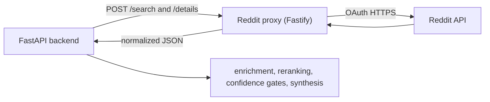

# Reddit Proxy Service

This service is the Node.js and Fastify boundary between Experts Panel and the Reddit OAuth API. It exposes a small HTTP interface for Reddit search and deep thread retrieval. The Python backend remains responsible for search planning, additional discovery channels, candidate deduplication, answerability reranking, confidence filtering, and synthesis.

The proxy runs as a separate Docker service in production. A proxy failure does not remove expert answers that the main pipeline has already completed.

## Responsibilities

The proxy handles:

- Reddit password-grant OAuth and access-token reuse
- direct Reddit search with optional subreddit targeting
- full post and nested comment retrieval
- Reddit rate-limit headers, pre-emptive gating, and bounded `429` retries
- single-flight token refresh for concurrent requests
- input validation with Zod
- text sanitization that preserves Markdown code blocks
- a five-minute in-memory LRU search cache
- a health endpoint for Docker and operational checks

The proxy does not handle:

- AI Scout query planning
- Arctic Shift or Serper.dev discovery
- cross-channel candidate deduplication
- anti-spam scoring or answerability reranking
- confidence thresholds or abstention policy
- LLM synthesis

Those steps live in `backend/src/services/reddit_enhanced_service.py` and `backend/src/services/reddit_synthesis_service.py`.

## Runtime architecture



The service talks to `oauth.reddit.com` directly. The previous `reddit-mcp-buddy` process and stdio MCP hop are no longer part of the runtime.

## API

### `POST /search`

Search Reddit directly. `sort=relevance` is the normal query-sensitive path. Reddit's `top` and `new` modes may favor popularity or recency over the query.

Request:

```json
{
  "query": "Claude Code MCP server setup",
  "limit": 10,
  "subreddits": ["ClaudeAI", "ClaudeCode"],
  "sort": "relevance",
  "time": "year"
}
```

Response shape:

```json
{
  "foundCount": 2,
  "sources": [
    {
      "title": "Example discussion",
      "url": "https://reddit.com/r/ClaudeAI/comments/example",
      "score": 42,
      "commentsCount": 18,
      "subreddit": "ClaudeAI",
      "selftext": "Post body when available",
      "top_comments": [],
      "created_utc": 1787600000
    }
  ],
  "query": "Claude Code MCP server setup",
  "processingTimeMs": 1250
}
```

The service may fetch details for the highest-ranked direct search results before returning them. The Python backend performs the broader enrichment and reranking pass across all discovery channels.

### `POST /details`

Fetch one post and its nested comment tree. Reddit resolves the post by ID, so the request does not require a subreddit.

Request:

```json
{
  "postId": "1h2j3k4",
  "comment_limit": 100,
  "comment_depth": 5
}
```

The response contains the post body, metadata, and normalized comments. Comment entries retain score, author, creation time, nesting, OP status, flair, moderator status, stickiness, permalink, and replies when Reddit supplies those fields.

### `GET /health`

The health response reports whether all required Reddit credentials are configured. It does not make a live Reddit request on every probe.

```json
{
  "status": "healthy",
  "redditCredsConfigured": true,
  "uptime": 3600,
  "timestamp": "2026-08-25T12:00:00.000Z",
  "redditRateLimitRemaining": 87.4
}
```

`status` becomes `degraded` when the required credentials are missing. The endpoint still returns HTTP `200` so the response body carries the diagnostic state.

## Configuration

Create `services/reddit-proxy/.env` for local development. Do not commit real credentials.

```dotenv
PORT=3000
LOG_LEVEL=info
CACHE_TTL_MS=300000

REDDIT_CLIENT_ID=
REDDIT_CLIENT_SECRET=
REDDIT_USERNAME=
REDDIT_PASSWORD=
REDDIT_USER_AGENT=android:com.experts.panel:v1.0 (by /u/YOUR_REDDIT_USERNAME)
```

| Variable | Required | Default | Purpose |
|---|---:|---|---|
| `REDDIT_CLIENT_ID` | Yes | none | Reddit application client ID |
| `REDDIT_CLIENT_SECRET` | Yes | none | Reddit application client secret |
| `REDDIT_USERNAME` | Yes | none | Reddit account used by the password grant |
| `REDDIT_PASSWORD` | Yes | none | Reddit account password |
| `REDDIT_USER_AGENT` | Yes in practice | project fallback | Reddit-compliant client identification |
| `PORT` | No | `3000` | Fastify listen port |
| `CACHE_TTL_MS` | No | `300000` | Search cache lifetime in milliseconds |
| `LOG_LEVEL` | No | `debug` | Service logging level |

The main backend must point `REDDIT_PROXY_URL` at this service. Use `http://localhost:3000` for local development. Production uses the Docker Compose service address `http://reddit-proxy:3000`.

## Local development

Requirements:

- Node.js 20 or newer
- a Reddit application and account credentials

Install dependencies and start the TypeScript development process:

```bash
cd services/reddit-proxy
npm ci
npm run dev
```

Build and run the compiled service:

```bash
npm run build
npm start
```

Check it locally:

```bash
curl http://localhost:3000/health
```

## Docker

Build and run the image from this directory:

```bash
docker build -t experts-reddit-proxy .
docker run --rm --env-file .env -p 3000:3000 experts-reddit-proxy
```

The image builds TypeScript, prunes development dependencies, runs as a non-root user, and includes a Docker health check against `/health`.

## Production deployment

Production runs on the same Oracle VM as the main Experts Panel application. Docker Compose keeps `panel`, `reddit-proxy`, and Caddy as separate services. The proxy is reachable by the backend over the private Compose network and is not exposed as a separate public product endpoint.

A push to `main` triggers `.github/workflows/deploy-oracle.yml`. The workflow connects to the VM, pulls the selected commit, rebuilds the Compose services, and checks the main application health endpoint. Secrets remain in VM-side environment files and GitHub Actions secrets. They are not stored in this repository.

## Checks

```bash
cd services/reddit-proxy
npm run typecheck
npm run build
```

The repository CI builds the main backend and frontend images and validates the repository Docker Compose configuration. The production deployment rebuilds the sidecar through the VM-side Compose file. There is no committed sidecar-specific automated test suite at present, so type checking, build validation, deployment checks, and production query evidence are distinct forms of verification.

## Operational boundaries

- The search cache is process-local and disappears on restart.
- `/health` verifies configuration, not live Reddit reachability.
- Reddit rate limits and upstream availability can still reduce or delay results.
- Multi-channel discovery and graceful abstention belong to the Python backend, not this proxy.
- The UI treats Reddit as optional. Empty or failed community evidence does not invalidate completed expert responses.

## Related documentation

- [Reddit Search V2 architecture](../../docs/architecture/reddit-service.md)
- [Full pipeline architecture](../../docs/architecture/pipeline.md)
- [Root project README](../../README.md)

## License

MIT
