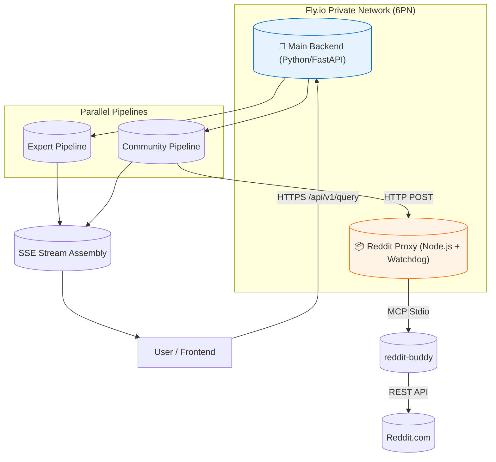

# Spec 004: Reddit MCP Microservice Integration ("Sidecar" Architecture)

**Status:** Final Gold Master (v7)
**Date:** 2026-01-31
**Target System:** Fly.io Microservices Architecture

## 1. Overview

This specification details the architecture for integrating Reddit search capabilities into the Experts Panel using a **Microservice/Sidecar pattern**. Instead of integrating the Reddit MCP (Model Context Protocol) server directly into the main Python monolith, we will deploy it as a standalone, isolated Node.js service on Fly.io.

## 2. Architecture Diagram

## 3. Component Design

### 3.1. Microservice: `experts-reddit-proxy` (The "Fortress")

A Node.js application built for resilience.

*   **Stack**: Node.js 20-alpine, Fastify, `@modelcontextprotocol/sdk`.
*   **Process Management (Watchdog)**:
    *   **Persistent Process**: Spawns `reddit-buddy` once.
    *   **Queue**: `p-queue` (concurrency: 1).
    *   **Timeout & Kill**: If any MCP call takes >15s, the promise rejects, and the **child process is SIGKILL'ed and respawned immediately**. This prevents "zombie" states.
*   **User-Agent**: Enforces `android:com.experts.panel:v1.0 (by /u/External-Way5292)`.
*   **Sanitization**: Strips Zalgo text and excessive whitespace from Reddit responses before returning.
*   **API**: `POST /search` -> `{"markdown": "...", "found_count": 3}`.

### 3.2. Main Backend Integration

*   **Service**: `src/services/reddit_service.py`.
*   **Keep-Alive Strategy**:
    *   While awaiting `RedditSynthesis`, the SSE stream must emit periodic "ping" comments (`: keep-alive`) every 2-3 seconds to prevent Load Balancer timeouts.

### 3.3. Pipeline Integration

*   **Service**: `src/services/reddit_synthesis_service.py`.
*   **Fail Safe**: Wrapped in a broad `try/except`. If Reddit pipeline explodes, the User still gets the Expert answer.

### 3.4. Prompt Strategy

> "You are a Community Analyst...
> 1. **Reality Check**: Bugs, edge cases, hardware issues.
> 2. **Hacks**: Workarounds.
> 3. **Vibe**: Sentiment."

## 4. Implementation Plan

### Phase 1: Local Prototype (Robust Proxy)

1.  Create `services/reddit-proxy`.
2.  Initialize Node.js project.
3.  **Dependencies**: `fastify`, `@modelcontextprotocol/sdk`, `p-queue`, `lru-cache`, `cross-spawn`, `dotenv`.
4.  **Implement `index.ts`**:
    *   Watchdog logic (Timeout -> Kill -> Respawn).
    *   Smart Aggregation (Search x2 -> Filter -> Fetch -> Sanitize).
5.  **Environment**:
    *   `REDDIT_USER_AGENT="android:com.experts.panel:v1.0 (by /u/External-Way5292)"`

### Phase 2: Deployment Configuration

1.  `Dockerfile`: `RUN npm install -g @modelcontextprotocol/server-reddit-buddy`.
2.  `fly.toml`: Health checks.

### Phase 3: Backend Integration

1.  Update `simplified_query_endpoint.py` with Keep-Alive SSE.
2.  Implement Python services.

### Phase 4: Frontend Update

1.  New Component: `<CommunityInsightsSection />`.

## 5. Technical Details

### 5.1. Fly.io Internal Networking
*   Node app binds to `::` (IPv6).

## 6. Risks & Mitigation

| Risk | Mitigation |
| :--- | :--- |
| **Stalled Process** | Watchdog kills/respawns process on 15s timeout. |
| **LB Timeout** | SSE Keep-Alive pings. |
| **API Ban** | Strict User-Agent compliance. |

## 7. Actionable Next Steps

1.  **Execute Phase 1**: Build the local smart bridge.