# Spec 004: Reddit MCP Microservice Integration ("Sidecar" Architecture)

**Status:** Phase 1 & 2 COMPLETE ✅ | Phase 3 READY TO START  
**Date:** 2026-02-04  
**Target System:** Fly.io Microservices Architecture  
**Production URL:** https://experts-reddit-proxy.fly.dev/

---

## 📋 Executive Summary

This specification details the architecture for integrating Reddit search capabilities into the Experts Panel using a **Microservice/Sidecar pattern**. 

**✅ COMPLETED:**
- Phase 1: Local Prototype with Watchdog pattern
- Phase 2: Production Deployment on Fly.io
- Reddit Proxy Service live and operational

**⏳ NEXT:** Phase 3 - Backend Integration

---

## 1. Overview

Instead of integrating the Reddit MCP (Model Context Protocol) server directly into the main Python monolith, we deploy it as a standalone, isolated Node.js service on Fly.io.

### Architecture Diagram

```mermaid
graph TD
    subgraph "Fly.io Private Network (6PN)"
        MainApp[("🐍 Main Backend<br/>Python/FastAPI")]
        RedditService[("📦 Reddit Proxy<br/>Node.js + Watchdog")]
    end

    User[User/Frontend] -- "HTTPS /api/v1/query" --> MainApp
    
    subgraph "Parallel Pipelines"
        direction TB
        ExpertPipe[("Expert Pipeline<br/>8-phase Map-Reduce")]
        RedditPipe[("Community Pipeline<br/>Reddit + Synthesis")]
    end

    MainApp --> ExpertPipe
    MainApp --> RedditPipe
    
    RedditPipe -- "HTTP POST<br/>/search" --> RedditService
    RedditService -- "MCP Stdio<br/>JSON-RPC" --> RedditMCP[("reddit-buddy<br/>MCP Server")]
    RedditMCP -- "REST API<br/>OAuth" --> RedditAPI[("Reddit.com")]
    
    ExpertPipe --> FinalResp
    RedditPipe --> FinalResp
    
    FinalResp[("SSE Stream<br/>Assembly")] --> User

    style MainApp fill:#e6f3ff,stroke:#0066cc
    style RedditService fill:#90EE90,stroke:#228B22,stroke-width:3px
    style RedditPipe fill:#fff3e6,stroke:#ff6600
```



---

## 2. Phase 1 & 2: COMPLETED ✅

### 2.1 Reddit Proxy Microservice (`services/reddit-proxy/`)

**Status:** ✅ PRODUCTION READY  
**Location:** `/Users/andreysazonov/Documents/Projects/Experts_panel/services/reddit-proxy/`

#### Implemented Features

| Feature | Implementation | Status |
|---------|----------------|--------|
| **Stack** | Node.js 20-alpine, Fastify, MCP SDK | ✅ |
| **Watchdog Pattern** | Persistent process, p-queue (concurrency: 1), 15s timeout, SIGKILL + respawn | ✅ |
| **Smart Aggregation** | `browse_subreddit` primary → `search_reddit` fallback → Filter → Sanitize | ✅ |
| **Text Sanitization** | Zalgo removal (5 Unicode ranges), whitespace normalization | ✅ |
| **Caching** | LRU cache, 100 entries, 5-min TTL | ✅ |
| **API Endpoints** | `GET /health`, `POST /search` | ✅ |

#### API Contract

**POST /search**
```json
// Request
{
  "query": "string (1-500 chars)",
  "limit": 1-25 (default: 10),
  "subreddits": ["string"] (optional),
  "sort": "relevance|hot|new|top" (default: relevance),
  "time": "hour|day|week|month|year|all" (default: all)
}

// Response
{
  "markdown": "string (formatted results)",
  "foundCount": number,
  "sources": [
    {
      "title": "string",
      "url": "string",
      "score": number,
      "commentsCount": number,
      "subreddit": "string"
    }
  ],
  "query": "string",
  "processingTimeMs": number
}
```

#### Key Implementation Details

**Tool Name Mapping:**
- `browse_subreddit` - Primary tool for subreddit browsing (returns `{posts: [], total_posts: N}`)
- `search_reddit` - Fallback for search queries (returns `{results: [], total_results: N}`)

**⚠️ CRITICAL: Different Response Structures**

| Tool | Posts Field | Total Field |
|------|-------------|-------------|
| `browse_subreddit` | `posts` | `total_posts` |
| `search_reddit` | `results` | `total_results` |

Code handles both formats:
```typescript
const postsArray = result.posts || result.results || [];
```

**URL Handling:**
```typescript
// browse_subreddit returns full URLs in permalink
// search_reddit returns relative URLs
const url = r.permalink.startsWith('http') 
  ? r.permalink 
  : `https://reddit.com${r.permalink}`;
```

**Smart Aggregation Strategy:**
1. If `subreddits` provided → Try `browse_subreddit` first
2. If browse fails or empty → Fallback to `search_reddit`
3. If no `subreddits` → Use `search_reddit` directly

**Debug Logging:**
Set `LOG_LEVEL=debug` to see:
- Raw MCP responses
- Tool selection decisions
- Cache hits/misses

### 2.2 Production Deployment

**Platform:** Fly.io  
**URL:** https://experts-reddit-proxy.fly.dev/  
**Status:** 🟢 LIVE

#### Configuration

```toml
# fly.toml
app = "experts-reddit-proxy"
primary_region = "ams"

[env]
PORT = "3000"
LOG_LEVEL = "info"
MCP_TIMEOUT_MS = "15000"
CACHE_TTL_MS = "300000"
MCP_COMMAND = "npx"
MCP_ARGS = "-y reddit-mcp-buddy"

[http_service]
internal_port = 3000
auto_stop_machines = true
min_machines_running = 0

[[vm]]
cpu_kind = "shared"
cpus = 1
memory_mb = 512
```

#### Secrets (Configured)

```bash
REDDIT_CLIENT_ID=-SPb2C1BNI82qJVWSej41Q
REDDIT_CLIENT_SECRET=ry0Pvmuf9fEC-vgu4XFh5tDE82ehnQ
REDDIT_USERNAME=External-Way5292
REDDIT_PASSWORD=3dredditforce
REDDIT_USER_AGENT=android:com.experts.panel:v1.0 (by /u/External-Way5292)
```

**Mode:** Authenticated (100 req/min) vs Anonymous (10 req/min)

#### Infrastructure

| Resource | Value |
|----------|-------|
| Machines | 2 (high availability) |
| Region | ams (Amsterdam) |
| Health Checks | /health endpoint |
| Auto-scaling | 0-2 machines |

---

## 3. Phase 3: Backend Integration (⏳ NEXT)

### 3.1 Architecture Overview

```
User Query
    ├── Expert Pipeline (async)
    │   └── SSE: expert_partial, expert_complete
    ├── Reddit Pipeline (async)
    │   ├── Reddit Service HTTP call
    │   ├── Reddit Synthesis (Gemini)
    │   └── SSE: reddit_partial, reddit_complete
    └── Assembly
        └── SSE: final_response (Expert + Reddit merged)
```

### 3.2 Components to Implement

#### A. Reddit Service (`backend/src/services/reddit_service.py`)

**Purpose:** HTTP client for Reddit Proxy

**Requirements:**
- Async HTTP client (httpx/aiohttp)
- Timeout: 15s
- Retry: 3 attempts with exponential backoff
- Circuit breaker pattern
- Type hints throughout

**Interface:**
```python
class RedditService:
    async def search(
        self,
        query: str,
        limit: int = 10,
        subreddits: list[str] | None = None,
        sort: str = "relevance",
        time: str = "all"
    ) -> RedditSearchResult:
        """Search Reddit via Proxy Service."""
        ...
```

#### B. Reddit Synthesis Service (`backend/src/services/reddit_synthesis_service.py`)

**Purpose:** Analyze Reddit content via Gemini

**Prompt Strategy:**
```
You are a Community Analyst analyzing Reddit discussions.
Given the user's query and Reddit posts found, extract insights:

1. **Reality Check**: Bugs, edge cases, hardware issues mentioned
2. **Hacks**: Workarounds and unofficial solutions
3. **Vibe**: Overall sentiment and community opinion

Format output as markdown with bullet points.
Cite specific posts when making claims.
```

**Interface:**
```python
class RedditSynthesisService:
    async def synthesize(
        self,
        query: str,
        reddit_posts: list[RedditPost],
        model: str = "gemini-2.0-flash"
    ) -> str:
        """Synthesize Reddit insights via Gemini."""
        ...
```

#### C. Pipeline Integration (`backend/src/api/simplified_query_endpoint.py`)

**Changes Required:**

1. **Parallel Execution:**
```python
# Current: Only Expert pipeline
expert_task = asyncio.create_task(process_expert(query))

# New: Both pipelines in parallel
expert_task = asyncio.create_task(process_expert(query))
reddit_task = asyncio.create_task(process_reddit(query))

results = await asyncio.gather(expert_task, reddit_task, return_exceptions=True)
```

2. **Keep-Alive SSE:**
```python
# While waiting for Reddit (can be slow)
async def emit_keep_alive():
    while not reddit_complete:
        yield sse_event(": keep-alive\n\n")
        await asyncio.sleep(2.5)
```

3. **Fail-Safe:**
```python
try:
    reddit_result = await reddit_task
except Exception as e:
    logger.error(f"Reddit pipeline failed: {e}")
    reddit_result = None  # Don't fail whole request
```

4. **Response Merge:**
```python
final_response = MultiExpertQueryResponse(
    expert_responses=expert_results,
    reddit_response=reddit_result,  # NEW FIELD
    processing_time_ms=total_time
)
```

#### D. Pydantic Models Update (`backend/src/api/models.py`)

```python
class RedditSource(BaseModel):
    title: str
    url: str
    score: int
    comments_count: int
    subreddit: str

class RedditResponse(BaseModel):
    markdown: str
    found_count: int
    sources: list[RedditSource]
    query: str
    processing_time_ms: int

class MultiExpertQueryResponse(BaseModel):
    expert_responses: list[ExpertResponse]
    reddit_response: RedditResponse | None = None  # NEW
    total_processing_time_ms: int
    timestamp: datetime
```

### 3.3 Frontend Integration

#### A. CommunityInsightsSection Component

```typescript
interface CommunityInsightsSectionProps {
  redditResponse: RedditResponse | null;
  isLoading: boolean;
}

// Features:
// - Render markdown from Reddit
// - Clickable source links
// - Collapsible section
// - Loading skeleton
// - Error state handling
```

#### B. ExpertAccordion Update

Add new tab/section:
- Tab 1: Expert Responses
- Tab 2: Community Insights (NEW)

### 3.4 Testing Plan

| Test Case | Expected Result |
|-----------|-----------------|
| Expert only query | Returns expert response, reddit=null |
| Both pipelines success | Merged response with both |
| Reddit fails | Expert response still returned |
| Reddit slow | Keep-alive pings prevent timeout |
| Empty Reddit results | "No community discussions found" |

---

## 4. Key Technical Decisions

### 4.1 Why Sidecar Pattern?

| Aspect | Monolithic | Sidecar (Chosen) |
|--------|-----------|------------------|
| **Isolation** | MCP process crashes = backend down | Independent process |
| **Resilience** | Single point of failure | Watchdog auto-respawn |
| **Scaling** | Scale entire backend | Scale Reddit service independently |
| **Language** | Python wrapper for Node.js MCP | Native Node.js |

### 4.2 Tool Selection Strategy

**Primary: `browse_subreddit`**
- More reliable for popular subreddits
- Faster response
- Better for "what's hot" queries
- **Limitation:** sort must be `hot|new|top|rising`, NOT `relevance`
- When `sort=relevance` requested, falls back to `hot`

**Fallback: `search_reddit`**
- Good for specific keywords
- Works across all Reddit
- Supports all sort options including `relevance`
- Slightly slower

**Auto-selection Logic:**
```typescript
if (subreddits.length > 0) {
  // browse_subreddit with sort fallback
  sort: sort === 'relevance' ? 'hot' : sort
} else {
  // search_reddit with original sort
  sort: sort
}
```

### 4.3 Authentication

**Implemented:** OAuth with Reddit credentials
- Rate limit: 100 req/min (vs 10 anonymous)
- Required for production reliability
- Credentials stored in Fly.io secrets

---

## 5. Known Issues & Limitations

| Issue | Workaround | Status |
|-------|-----------|--------|
| `search_reddit` returns `results` not `posts` | Handle both formats in code | ✅ Fixed |
| Reddit search can be empty | Fallback to `browse_subreddit` | ✅ Implemented |
| MCP Stdio transport | Requires persistent process | ✅ Watchdog handles |

---

## 6. File Locations

### Completed (Phase 1 & 2)

```
services/reddit-proxy/
├── src/index.ts              # Main application (700+ lines)
├── package.json              # Dependencies
├── tsconfig.json             # TypeScript config
├── Dockerfile                # Production container
├── fly.toml                  # Fly.io deployment
├── .env.example              # Environment template
├── .env                      # Local secrets (gitignored)
├── .dockerignore             # Docker exclusions
├── .gitignore                # Git exclusions
├── README.md                 # Documentation
├── PHASE1_FINAL_AUDIT.md     # Detailed audit
├── PHASE2_DEPLOYMENT_REPORT.md  # Deployment log
└── PHASE2_FINAL_REPORT.md    # Summary
```

### To Create (Phase 3)

```
backend/src/
├── services/
│   ├── reddit_service.py              # NEW
│   └── reddit_synthesis_service.py    # NEW
├── api/
│   └── simplified_query_endpoint.py   # MODIFY
└── models.py                          # MODIFY

frontend/src/components/
└── CommunityInsightsSection.tsx       # NEW
```

---

## 7. Quick Reference for Next Session

### Production URLs
```
Health Check: https://experts-reddit-proxy.fly.dev/health
Search API:   https://experts-reddit-proxy.fly.dev/search
```

### Test Queries

**Search (uses search_reddit):**
```bash
curl -X POST https://experts-reddit-proxy.fly.dev/search \
  -H "Content-Type: application/json" \
  -d '{"query": "python tips", "limit": 3}'
```

**Browse Subreddit (uses browse_subreddit):**
```bash
curl -X POST https://experts-reddit-proxy.fly.dev/search \
  -H "Content-Type: application/json" \
  -d '{"query": "programming", "subreddits": ["programming"], "limit": 3}'
```

**Expected Response:**
```json
{
  "markdown": "### 1. Post Title\n\n**r/subreddit** | Score: 100 | Comments: 50\n\nContent preview...\n\n[Read on Reddit](https://reddit.com/r/...)",
  "foundCount": 3,
  "sources": [
    {
      "title": "Post Title",
      "url": "https://reddit.com/r/...",
      "score": 100,
      "commentsCount": 50,
      "subreddit": "subreddit"
    }
  ],
  "query": "python tips",
  "processingTimeMs": 1200
}
```

### Credentials (Already in Fly.io)
```
REDDIT_CLIENT_ID, REDDIT_CLIENT_SECRET
REDDIT_USERNAME, REDDIT_PASSWORD
REDDIT_USER_AGENT
```

**Status:** ✅ Authenticated mode active
**Rate Limit:** 100 requests/minute
**Last Verified:** 2026-02-04

### First Task for Phase 3
Create `backend/src/services/reddit_service.py` with HTTP client to Reddit Proxy.

---

**Phase 3 Status:** Ready to Start  
**Next Action:** Implement Python Reddit Service  
**Contact:** External-Way5292 (Reddit credentials owner)