# Spec 004: Reddit MCP Microservice Integration ("Sidecar" Architecture)

**Status:** Draft
**Date:** 2026-01-30
**Target System:** Fly.io Microservices Architecture

## 1. Overview

This specification details the architecture for integrating Reddit search capabilities into the Experts Panel using a **Microservice/Sidecar pattern**. Instead of integrating the Reddit MCP (Model Context Protocol) server directly into the main Python monolith, we will deploy it as a standalone, isolated Node.js service on Fly.io.

This approach ensures:
*   **Isolation**: Reddit API credentials and Node.js dependencies are contained.
*   **Scalability**: The search service can be scaled independently.
*   **Security**: The service is accessible *only* via Fly.io's private IPv6 network (6PN), not the public internet.

## 2. Architecture Diagram

```mermaid
graph TD
    subgraph "Fly.io Private Network (6PN)"
        MainApp[("🐍 Main Backend (Python/FastAPI)")]
        RedditService[("📦 Reddit Proxy (Node.js + MCP)")]
    end

    User[User / Frontend] -- "HTTPS /api/v1/query" --> MainApp
    MainApp -- "HTTP POST (Internal DNS)" --> RedditService
    RedditService -- "Stdio / JSON-RPC" --> MCPServer[("Reddit Buddy MCP")]
    MCPServer -- "HTTPS" --> RedditAPI[("Reddit.com")]

    style MainApp fill:#e6f3ff,stroke:#0066cc
    style RedditService fill:#fff3e6,stroke:#ff6600
    style MCPServer fill:#fff3e6,stroke:#ff6600,stroke-dasharray: 5 5
```



## 3. Component Design

### 3.1. Microservice: `experts-reddit-proxy`

A lightweight Node.js application acting as an HTTP bridge to the MCP server.

*   **Stack**: Node.js 20-alpine, Fastify (or Express), `@modelcontextprotocol/sdk`.
*   **Core Logic**:
    1.  Spawns `npx @modelcontextprotocol/server-reddit-buddy` as a child process.
    2.  Connects to it using the MCP Client SDK.
    3.  Exposes a single HTTP endpoint: `POST /search`.
    4.  Translates the HTTP request into an MCP `tools/call` ("search_reddit").
        *   **Timeout**: Enforce a strict 15s timeout for tool calls to prevent hanging processes.
        *   **Caching**: Implement simple LRU cache (TTL 10 min) for identical queries to save API quotas.
    5.  Returns the result as JSON.
*   **Fly.io Config**:
    *   **No public services**: The `fly.toml` will NOT define a `[[services]]` block for ports 80/443.
    *   **Internal Port**: Exposes port 3000 to the private network. **Critical**: Node.js must listen on host `::` (IPv6), not just `0.0.0.0`, as Fly's internal network is IPv6-only.
    *   **Resources**: Recommended `guest.memory_mb = 512` to handle Node.js + MCP overhead without OOM.
    *   **Secrets**: `REDDIT_CLIENT_ID`, `REDDIT_CLIENT_SECRET`, `REDDIT_USERNAME`, `REDDIT_PASSWORD`, `REDDIT_USER_AGENT`.

### 3.2. Main Backend Integration

*   **New Service**: `src/services/reddit_service.py`.
*   **Logic**:
    *   Checks if `include_reddit` flag is true.
    *   Sends a POST request to `REDDIT_SERVICE_URL` (env var).
    *   **Timeouts**: Set connection/read timeout to **10-15s** to account for potential **Fly Machine Cold Starts**.
    *   **Normalization**: Parse raw MCP response into clean text blocks (Title + Content + URL) before passing to LLM.
    *   **Fail-safe**: If the microservice is down, log error and return empty results (do not crash the query).

### 3.3. Pipeline Integration (Map/Resolve)

We will inject Reddit data during the **Resolve** or **Reduce** phase.

*   **Strategy**: "Parallel Context Injection".
*   **Execution**:
    *   Run `RedditService.search(query)` in parallel with `MapService`.
    *   Inject Reddit posts as a special "Context Source" into the `ReduceService` prompt.
    *   Mark them clearly as "Community Context (Reddit)" to distinguish from "Expert Context".

## 4. Implementation Plan

### Phase 1: Local Prototype (The "Bridge")

1.  Create directory `services/reddit-proxy`.
2.  Initialize Node.js project.
3.  Implement `index.js` using `@modelcontextprotocol/sdk` to spawn the reddit-buddy server.
4.  Test locally: `curl -X POST localhost:3000/search -d '{"query": "RAG architecture"}'`.
5.  **Local Dev**: Add `reddit-proxy` service to `docker-compose.yml` and set `REDDIT_SERVICE_URL=http://reddit-proxy:3000` for the backend.

### Phase 2: Deployment Configuration (Apps V2)

1.  Create `services/reddit-proxy/Dockerfile`.
2.  Initialize Fly App (Apps V2 / Machines):
    ```bash
    fly launch --no-deploy --internal --name experts-panel-reddit-proxy
    ```
3.  **Secrets Management**:
    *   **Production**: Use `fly secrets set` to inject credentials safely into the Machine.
    *   **Local**: Use `.env` file with `docker-compose`.
    ```bash
    fly secrets set REDDIT_CLIENT_ID=... REDDIT_CLIENT_SECRET=... REDDIT_USERNAME=... REDDIT_PASSWORD=... REDDIT_USER_AGENT="android:com.experts.panel:v1.0 (by /u/YOUR_USER)"
    fly deploy
    ```

### Phase 3: Backend Integration

1.  Create `backend/src/services/reddit_service.py`.
2.  Implement `search_reddit(query: str)` method.
    *   Use `httpx` (async) or `requests`.
    *   Target URL: `REDDIT_SERVICE_URL` (env var).
    *   **Error Handling**:
        *   **429 (Rate Limit)**: Log warning, return `None` (do not retry aggressively).
        *   **500/Timeout**: Log error, return `None`.
        *   **Graceful Degradation**: If Reddit is down, the expert answer is returned without Reddit insights.
3.  Modify `backend/src/api/simplified_query_endpoint.py`.
    *   Add `include_reddit` boolean to `QueryRequest`.
    *   Call `reddit_service.search` if flag is set.
    *   Pass results to `ReduceService`.

### Phase 4: Frontend Update

1.  Update `QueryRequest` type in `frontend/src/types/api.ts`.
2.  Add "Include Reddit Insights" checkbox to `frontend/src/components/QueryForm.tsx`.
3.  Pass the flag to `apiClient.submitQuery`.

## 5. Technical Details & Constraints

### 5.1. The "Bridge" Code (Concept)

```javascript
// services/reddit-proxy/index.js (Conceptual)
import { Client } from "@modelcontextprotocol/sdk/client/index.js";
import { StdioClientTransport } from "@modelcontextprotocol/sdk/client/stdio.js";
import Fastify from "fastify";

const transport = new StdioClientTransport({
  command: "npx",
  args: ["-y", "@modelcontextprotocol/server-reddit-buddy"],
  env: process.env // Pass Reddit creds to child
});

const client = new Client({ name: "http-bridge", version: "1.0.0" });
await client.connect(transport);

const server = Fastify();

server.post("/search", async (request, reply) => {
  const { query } = request.body;
  try {
    const result = await client.callTool({
      name: "search_reddit",
      arguments: { query, limit: 5 }
    });
    return result;
  } catch (err) {
    return reply.code(500).send({ error: err.message });
  }
});

// CRITICAL: Bind to :: (IPv6) for Fly.io internal network
server.listen({ port: 3000, host: '::' }, (err, address) => {
  if (err) {
    console.error(err);
    process.exit(1);
  }
  console.log(`Server listening at ${address}`);
});
```

### 5.2. Fly.io Internal Networking

*   **DNS**: Fly automatically sets up `[app-name].internal` DNS records.
*   **Ports**: We must bind the Node app to `::` (IPv6) or `0.0.0.0` (IPv4) to be reachable. Fly's 6PN relies on IPv6.
*   **Security**: By NOT defining a `[http_service]` or `[[services]]` block in `fly.toml`, the app is *completely invisible* to the public internet. It accepts traffic ONLY from other apps in the same organization.

## 6. Risks & Mitigation

| Risk | Mitigation |
| :--- | :--- |
| **Reddit Rate Limits** | The MCP server likely handles basic throttling. We should add caching (Redis/Memory) in the Proxy later if needed. |
| **Service Latency** | Reddit is slow. We must set a hard timeout (e.g., 10s) in Python so we don't delay the Expert answers indefinitely. |
| **Credentials Ban** | Isolated container means we just update secrets/image in one place if we need to rotate accounts. |

## 7. Actionable Next Steps

1.  **Approve this Plan**: Confirm the architecture.
2.  **Gather Credentials**: Ensure we have the Reddit Client ID/Secret ready.
3.  **Execute Phase 1**: Build the local bridge script.
